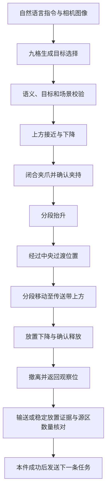
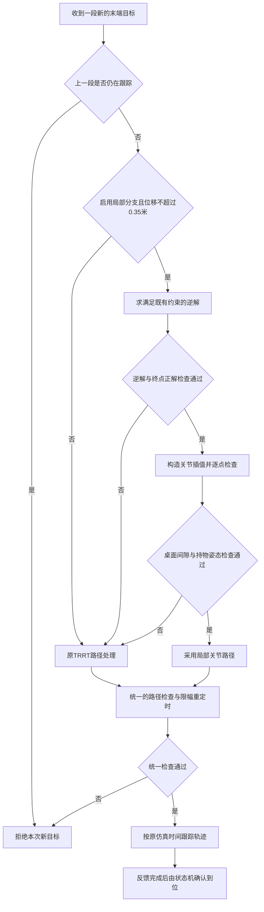

# 轨迹调优：机械臂执行提速的原理、方法与完整记录

记录日期：2026-09-18。实验实例：`a8xrp2yw-h322ghh8`。本文件依据代码修改、原始事件、ROS bag派生审计和实际仿真结果整理，保留各阶段的成功、失败、撤回方案及复测过程。

**最终状态：30个固定随机场景均已实际执行。首次实际执行22/30完整成功；最终固定V6的20轮为17/20完整成功，成功回合平均276.42秒。第24、26轮仍有规划候选失败，第28轮反复重抓未成功。第1～15节记录早期V1/V2提速，第16节以后记录后续识别、姿态、规划、恢复与压力测试；完整统计见第22节及[随机压力测试分析.md](D:/720/dog/2026TCEI/随机压力测试分析.md)。**

2026-09-19的V7续作另见第23节，最新为23.9：D02空夹渐闭/渐开通过，06无遮挡语义示例3/7通过，完整T1组通过0，V7抓取/整轮尚未执行；不改写上述原30轮结果。

## 1. 早期V1/V2提速验证结果与阅读范围

本次采用两阶段调优：先缩短短距离动作的最低期望时长、改进到位等待，再为局部动作增加通过检查后可直接使用的关节插值路径。最终两轮独立五件回合均成功，平均实际用时为 **261.542566 秒，约 4 分 21.54 秒**；同实例原版本为 **517.702069 秒，约 8 分 37.70 秒**，用时减少 **49.48%**。

| 版本 | 回合 | 完整验收 | 实际用时 / 秒 | 600 秒预算余量 / 秒 |
|---|---|---:|---:|---:|
| 本次调优前的基线 | `clean_deploy_round01` | 5/5 | 517.702069 | 82.297931 |
| V1：动作时长与到位判定 | `speed_v1_round01` | 5/5 | 372.076533 | 227.923467 |
| V2：再加入局部路径分支 | `speed_v2_round01` | 5/5 | 262.273857 | 337.726143 |
| 同一 V2 再次独立复测 | `speed_v2_round02` | 5/5 | 260.811275 | 339.188725 |

基线是同一新实例中此前已完成的真实回合；后面三轮是本次调优中的全部正式五件回合。这三轮均没有计时内人工恢复、场景重置或代码修改。两轮 V2 的平均节省时间为 **256.159503 秒**。

本次的“基线”已经包含此前完成的反馈核对、抓取与输送验收、轨迹重定时、桌面间隙和持物姿态检查等功能，不能将这些旧功能全部算成本轮新增。本文也不将旧实例的 600 秒超时记录直接用于计算本轮提速比例。

本次改动范围是机械臂执行与路径生成。九格的调用、提示词、语义修复、视觉感知和物品选择逻辑保留，未处理九格识别或加分问题。官方场景、物品位置初始化、传送带速度、仿真时钟倍率、物理时间步和机器人原始文件未因本次调优而修改。所有比赛回合仍使用 600 秒实际时间预算和原放置验收条件。

结果依据：[汇总数据](D:/720/dog/2026TCEI/evidence/2026-09-18-speed/optimization_summary.json)、[基线原始结果](D:/720/dog/2026TCEI/evidence/2026-09-18-speed/stage1/baseline/episode/summary.json)、[V1 原始结果](D:/720/dog/2026TCEI/evidence/2026-09-18-speed/stage1/speed_v1_round01/episode/summary.json)、[V2 第一轮](D:/720/dog/2026TCEI/evidence/2026-09-18-speed/stage1/speed_v2_round01/episode/summary.json)、[V2 第二轮](D:/720/dog/2026TCEI/evidence/2026-09-18-speed/stage2/speed_v2_round02/episode/summary.json)。

## 2. 原系统怎样完成一件物品的搬运



执行层与仿真中的规划层分工如下：

| 层次 | 主要实现 | 职责 |
|---|---|---|
| 回合驱动 | `run_episode.py` | 发自然语言任务、关联请求编号、管理整轮 600 秒期限 |
| 抓放状态机 | `controller.py` | 决定下一段末端目标，等待实际反馈，监测夹持，核对放置 |
| 仿真规划包装层 | `sim_with_feedback.py` | 求逆解、生成与检查关节路径、重定时、发布规划和跟踪状态 |
| 原镜像规划与跟踪 | `jaka_env.py` | 原 TRRT 搜索与路径处理，按仿真时间逐帧跟踪轨迹 |
| 时间参数化 | `trajectory_timing.py` | 给关节路径分配运动时间并限制指令速度、加速度 |

状态机每次只发送一次末端目标，避免重复消息让仿真排队执行同一目标。原有持物移动仍分段：抬升的最大步长为 0.04 米，其他持物搬运的默认最大步长为 0.12 米。V2 没有把整个抓放过程合并成一条不停顿的连续轨迹。

### 2.1 为什么先检查耗时分布

同实例基线有 103 次运动请求：97 次到达，6 次规划拒绝后改用备用落点。规划处理累计约 142.28 秒；按一位小数归并，88 段轨迹的安排时长为 2.0 个仿真秒。这说明大量短动作承担了相同的最低运动时长和到位等待，同时反复进行路径搜索。

原规划代码在各次搜索中使用随机采样，并在循环内重建查询树；实际调用的搜索步长为 0.01，最大迭代次数默认 5,000。它不是每次都执行满 5,000 次，但简单的近邻移动也会进入这条搜索流程。规划又在仿真主循环中同步执行，因此控制器可能暂时收不到新的位姿消息。

这次据此选择了两个可以分别观察效果的切入点：

1. 保留路径生成方式，先减少短动作的固定时间成本。
2. 在保留检查与原规划器的前提下，让适合的局部目标减少重复搜索。

依据：[基线规划审计](D:/720/dog/2026TCEI/evidence/2026-09-18-speed/stage1/baseline_planner_audit.json)、[原镜像规划源码快照](D:/720/dog/2026TCEI/research/2026-09-17-arm/source_snapshot_20260914/EAICON/Source/JAKA/jaka_env.py:72)。

## 3. 三种时间必须分开理解

| 名称 | 来源 | 含义与使用方式 |
|---|---|---|
| 整轮实际用时 | `summary.json / elapsed_seconds` | 回合驱动用单调时钟测量，包含任务推理、机器人执行、等待和验收；用于本次速度比较 |
| 规划处理用时 | `/tcei/planner_status / planning_seconds` | 包装层一次规划调用的实际经过时间，包含求解、路径处理、检查和重定时等，不是单独的 TRRT CPU 时间 |
| 轨迹仿真时长 | `timing.duration` | 轨迹沿仿真时间执行的安排时长；各段相加不能直接当成实际秒数 |

`controller.py` 某一运动阶段从发出目标到确认到达的实际时间，已经包含等待规划、轨迹执行和到位确认。**不能把“运动阶段合计”再加上“规划处理合计”，否则会重复计数。**

首次场景加载、模型加载、预检和回合之间的重置在正式回合计时之外。两轮之间重新准备场景是建立独立试验起点，不属于计时内人工恢复。

九格一次请求可能有两次回答，其日志 `elapsed` 是从同一请求起点累计的。审计对每个请求取最后、也就是最大的累计值，再在请求之间相加，避免将第一次推理重复计入。

## 4. V1 方法一：降低短距离动作的最低期望时长

### 4.1 修改前后

原包装层根据末端起终点距离 `d` 估算时间：

```python
# 本次调优前
desired = max(2.0, min(5.0, d / 0.15))

# V1 和 V2
desired = max(self.min_motion_seconds, min(5.0, d / 0.15))
# 本次实际使用 self.min_motion_seconds = 0.9
```

0.15 的单位为米/秒，用于估算期望时间，不表示机器人末端全程以恒定 0.15 米/秒移动。末端位移小于 0.30 米时，原来的 2 秒下限经常起作用；例如 4 厘米对应的简单距离估算只有约 0.267 秒，却仍先按至少 2 秒安排。

本次将该下限改为 0.9 秒，让短距离动作可以更快完成。0.9 秒是进入约束检查前的期望值，不是强制要求所有动作在 0.9 秒完成。

对应实现：[期望时长计算](D:/720/dog/2026TCEI/implementation/speed_20260918/candidate_v2/tcei_stack/sim_with_feedback.py:107)。

### 4.2 为什么不会直接越过已有指令限幅

生成路径后仍调用原有 `retime_path()`。本次没有修改这个函数，其主要过程是：

1. 以归一化时间 `u ∈ [0,1]` 计算五次时间进度曲线：`s(u) = 10u³ − 15u⁴ + 6u⁵`。
2. 沿输入的采样关节路径插值取点，让起点和终点附近的进度变化变缓；这一步不重新搜索路径。
3. 由离散关节位置计算指令速度与加速度。
4. 若超过限幅，拉长整段时间，再输出实际安排时长。

将初步计算的关节速度、加速度分别记为 `v`、`a`，放大时间的系数为：

```text
scale = max(1, max(|v| / v_limit), sqrt(max(|a|) / a_limit))
若 scale > 1，再乘以 1.01 的余量
最终时长 T = desired × scale
放大后的指令速度约为 v / scale
放大后的指令加速度约为 a / scale²
```

速度采用相邻采样点差分；加速度采用速度差分，并在首尾引入零速度边界。这里的限幅与峰值是离散轨迹指令上的计算结果，不能替代真实关节速度、力矩或连续时间动力学的独立测量。

本次沿用的约束是各机械臂关节 URDF 速度上限的 50%，以及 2 rad/s² 的指令加速度上限。原 URDF 六个机械臂转动关节的速度上限为约 3.141593 rad/s，因此包装层使用约 1.5707965 rad/s。夹爪开合与其行程逻辑没有通过这次修改加速。

`desired` 中的 5 秒也不是最终轨迹时长上限。约束可以继续拉长时间：实际 V2 的最长段仍约为 7.33 个仿真秒，说明限幅没有被 0.9 秒或 5 秒截断。

源码与测试：[原有重定时函数](D:/720/dog/2026TCEI/implementation/speed_20260918/candidate_v2/tcei_stack/trajectory_timing.py:5)、[短动作与限幅测试](D:/720/dog/2026TCEI/implementation/speed_20260918/candidate_v2/tcei_stack/test_trajectory_timing.py)。

### 4.3 该方法的效果边界

将 2 秒改为 0.9 秒，并不代表整轮用时能按 `0.9/2` 等比例下降。求逆解、搜索路径、夹持确认、传感器处理、到位等待和放置验收仍然占用实际时间；有些轨迹还会被限幅重新拉长。

本次 V1 的轨迹安排时长合计从基线约 205.49 个仿真秒降为 118.60 个仿真秒；整轮实际用时从 517.70 秒降到 372.08 秒。V1 同时改变了下一节的到位判定，所以这 145.63 秒改善是两个改动的联合结果，不能全部归给时长下限这一项。

## 5. V1 方法二：缩短等待，同时加强到位证据

### 5.1 原有判定与新增判定

原来每段在位置误差小于 0.008 米、姿态误差小于 0.07 rad，并满足启用后的规划完成反馈条件时，继续稳定等待超过 0.5 秒。

V1 保留上述位置、姿态和规划完成条件，将稳定窗口设为 0.2 秒，并新增 `ArrivalWindow`，要求有足够的新样本，而且这些样本显示末端已经接近静止。它改善的是等待过程，不能用来提前跳过尚未完成的轨迹。

| 判定项 | 本次配置 | 说明 |
|---|---:|---|
| 位置误差 | `< 0.008 m` | 原有阈值保留 |
| 姿态误差 | `< 0.07 rad` | 原有阈值保留，约 4.01° |
| 规划器完成反馈 | 启用 | 部署脚本传入 `_require_planner_feedback:=true` |
| 稳定窗口 | `>= 0.2 s` | 实际时间窗口，原来为超过 0.5 秒 |
| 合格新样本数 | `>= 3` | 重复读取同一次回调样本不计数，也不触发成功 |
| 相邻新样本时间间隔 | `0 < dt <= 0.3 s` | 间隔过大重新建立稳定窗口 |
| 估计末端线速度 | `<= 0.02 m/s` | 根据相邻反馈位置变化计算 |
| 估计末端角速度 | `<= 0.1 rad/s` | 根据相邻反馈四元数角差计算，约 5.73°/秒 |

位置/姿态误差是“当前位置离目标多远”，相邻样本速度是“当前位置是否仍在快速变化”。两类条件结合，防止机械臂只是短暂穿过目标容差范围就被认定完成。

本次部署启用了规划完成反馈，但控制器代码允许关闭该要求；因此上述结论以本次实际启动配置为前提，不应推广到任意启动参数。

对应源码：[到位条件组合](D:/720/dog/2026TCEI/implementation/speed_20260918/candidate_v2/tcei_stack/controller.py:193)、[ArrivalWindow](D:/720/dog/2026TCEI/implementation/speed_20260918/candidate_v2/tcei_stack/arrival_window.py)、[实际启动参数](D:/720/dog/2026TCEI/deployment/scripts/start_stack.sh:68)。

### 5.2 新样本与速度怎样计算

对于相邻两次有效反馈，记接收时间为 `t₁、t₂`，末端位置为 `p₁、p₂`：

```text
dt = t₂ − t₁
线速度估计 = ||p₂ − p₁|| / dt
角速度估计 = quaternion_error(q₂, q₁) / dt
```

`quaternion_error()` 使用归一化四元数点积的绝对值计算角差，使同一旋转的 `q` 与 `−q` 表示不会被误判为不同姿态。

这里的样本时间是 ROS 位姿回调中保存的 `time.monotonic()`，即本机接收到回调的时间，并不是相机或机器人消息头的原始采样时刻。它能区分“同一反馈被循环反复读取”和“收到了新的回调”，但单靠该机制不能证明上游设备从未重发陈旧内容。

`ArrivalWindow.observe()` 按下列顺序工作：

1. 若位置、姿态或规划状态不合格，清空稳定起点与合格样本计数。
2. 若样本时间没有前进，直接返回未到位。
3. 有前一条样本时，计算时间间隔、位置速度和角速度；第一条样本本身不足以估算速度。
4. 时间间隔或速度不合格时，重新建立稳定窗口。
5. 只有合格新样本持续达到窗口时间，并且数量足够，才返回到位。

例如组件测试输入时间 `0.00、0.10、0.20、0.31` 秒的静止反馈：第一条用于建立前一采样，0.10 秒起开始累计稳定窗口，到 0.31 秒才同时满足三个合格样本与超过 0.2 秒的条件。对重复时间戳、快速移动、离开目标范围或采样中断，测试要求不能直接报完成。

### 5.3 位姿与时间必须来自同一次读取

为避免异步回调在读取过程中更新数据，`read_pose()` 增加可选参数：

```python
def read_pose(self, with_stamp=False):
    with self.lock:
        p = self.pose
        t = self.pose_seen
    # 原有新鲜度检查与位置、四元数提取保持
    return (xyz, q, t) if with_stamp else (xyz, q)
```

`move()` 使用 `actual, aq, sample_at = self.read_pose(with_stamp=True)`。这样避免把先读到的旧位姿配上后一次回调的接收时间。其他调用点仍可以按原接口接收两个返回值。

控制器还保留了对当前规划反馈的关联核对：反馈时间不得早于发出目标，位置和四元数必须匹配当前目标。锁存的旧完成消息不能单独使新目标到位。

### 5.4 原异常处理保留

- 位姿或持物反馈超过 1.5 秒未更新时，不能使用旧样本宣布到位。
- 原同步规划导致的初始反馈间断仍有最多约 15 秒的宽限；恢复前重置稳定窗口。
- 轨迹结束后，若超过 3 秒仍未进入原位置/姿态容差，则报错。
- 单段默认 45 秒超时、持物丢失超过 0.6 秒的处理、整轮期限与取消检查保留。
- 释放确认仍使用原来的超过 0.3 秒窗口；抓取确认仍要求夹持状态持续超过 0.45 个仿真秒。这两处未一并改成 0.2 秒。

停止发送后续目标不等于硬件急停。原仿真 ROS 接口对于已经接受的轨迹可能继续执行，这一既有限制没有因本次调优消失。

### 5.5 实际日志中的稳定窗口

| 回合 | 完成段数 | 稳定窗口中位数 / 实际秒 | 稳定窗口合计 / 实际秒 | 单段最少合格样本数 |
|---|---:|---:|---:|---:|
| V1 | 97 | 0.20298 | 19.71767 | 5 |
| V2 第一轮 | 96 | 0.20175 | 19.57111 | 4 |
| V2 第二轮 | 96 | 0.20129 | 19.43242 | 4 |

这些值来自 `arrived` 事件中的 `stable_seconds` 和 `fresh_samples`。实际没有出现“把三次循环计数当成三条反馈就结束”的情况。

以基线 97 次完成、每次超过 0.5 秒计算，原稳定窗口仅理论下界就超过 48.5 秒；新窗口合计约 19.7 秒，说明等待确有压缩空间。但这里没有覆盖等待合格状态形成之前的时间，不能把两个数字的差额当作已经独立测得的整轮净收益。

## 6. V2 方法：为局部目标增加经过检查的关节插值路径

### 6.1 为什么进行第二阶段修改

V1 成功后，整轮已从 517.70 秒降至 372.08 秒，但规划处理合计仍为 147.69 秒，与基线的 142.28 秒相近。短动作执行变快以后，反复搜索路径成为更明显的耗时部分。

V2 因此增加了一条局部分支：对于末端起终点距离不超过 0.35 米的目标，先尝试构造简单的关节插值路径；检查不通过时继续使用原规划器。0.35 米是本次采用并通过当前场景验证的工程门槛，不是由机器人理论工作空间推导出的普遍安全半径。

### 6.2 分支选择流程



对应的分支核心为：

```python
direct = (
    self.use_direct_path
    and np.linalg.norm(target_pos - start_position) <= 0.35
    and self.prepare_direct_trajectory(target_pos, target_rot_wxyz, duration)
)
if not direct:
    # 调用保留的原规划流程
    super().plan_and_execute_trajectory(...)
```

此处是逻辑摘录；完整实现还临时接入已有 `solve_clearance_ik()`，并在 `finally` 中恢复原求逆解入口。来源：[分支选择](D:/720/dog/2026TCEI/implementation/speed_20260918/candidate_v2/tcei_stack/sim_with_feedback.py:71)。

### 6.3 求逆解与终点检查

新分支复用已有的 `solve_clearance_ik()`，没有另外引入一个未经测试的逆解器。该函数保留：

- 机械臂关节顺序与运动学模型顺序的一致性检查。
- 当前关节位置及其他预设初值的多初值求解。
- 关节范围检查及周期关节配置归一化。
- 持物时拒绝相对当前配置跨越大于 π 的单关节变化。
- 目标配置的既有桌面间隙检查，并在有效候选中优先选择离当前关节配置较近的解。

得到目标关节角后再做一次正运动学检查：目标关节角对应的末端位置与请求位置之间的误差应不超过 0.005 米。这个“求逆解后再用正解核对”的步骤用于避免把无效或坐标解释错误的解交给跟踪器。

四元数转换沿用当前镜像兼容约定，本次没有同时更改 ROS/Isaac 姿态字段解释。将此代码搬到其他机器人或实机时，需要重新核对坐标系与四元数约定。

### 6.4 怎样生成关节路径

给定当前六关节配置 `q_start` 与目标配置 `q_goal`，按下式采样：

```text
q(u) = q_start + u × (q_goal − q_start)，u 从 0 到 1
N = max(61, ceil(max(|q_goal − q_start|) / 0.025) + 1)
```

也就是至少检查 61 个关节配置；关节变化较大时增加采样点，使任一关节相邻采样增量不超过约 0.025 rad。起点和终点被显式保留，非有限数值或向量维度不一致会被拒绝。

**关节空间线性插值不等于末端在三维空间中走直线。** 前者让各关节按比例变化，末端轨迹仍可能弯曲。因此，代码不是只判断起终点可达，而是继续检查中间采样配置。

来源：[关节路径生成器](D:/720/dog/2026TCEI/implementation/speed_20260918/candidate_v2/tcei_stack/joint_path.py)。

### 6.5 路径检查具体覆盖什么

新分支对生成的每个采样配置执行以下既有检查：

| 检查 | 实现条件 | 实际覆盖范围 |
|---|---|---|
| 桌面间隙 | `Link_03` 高度不低于基座参考高度加 0.09 米；`Link_04` 不低于参考高度加 0.07 米 | 两个连杆参考点的高度检查 |
| 持物姿态 | 夹爪命令绝对值大于 0.001 时，各采样末端旋转与目标旋转角差不超过 0.035 rad | 约 2.01° 的规划姿态变化约束 |
| 终点正解 | 请求末端位置与目标关节配置的正解位置相差不超过 0.005 米 | 末端位置一致性 |

持物姿态检查的分支标记来自夹爪命令状态；执行时另有实际夹持反馈监测，两者承担不同作用。

局部路径通过后，仍进入公共的路径复核与重定时流程。公共复核沿用原采样检查方式，并继续计算姿态偏差、指令速度峰值与加速度峰值。

这些检查并未覆盖所有连杆表面、环境网格、夹爪与物体接触、连续扫掠体或自碰撞。原镜像 TRRT 调用中的碰撞验证回调为 `lambda q: True`，保留原规划器也不能被写成“已经具备完整碰撞保障”。本次验证证明的是当前场景中、既有检查范围内的真实运行表现。

### 6.6 回退、拒绝与实际执行的区别

下列情况会进入原规划流程：局部分支关闭、末端位移超过 0.35 米、局部候选求解或其前置路径检查返回失败。

上一段仍在跟踪时直接拒绝新目标；发生异常、或者公共路径检查未通过时，也会清理本次规划状态并报告拒绝。**并非所有异常都会自动重新调用原规划器。** 状态机收到放置阶段的规划拒绝后，仍可以按原逻辑尝试有限的备用落点；其他失败按已有规则结束任务。

两轮 V2 各有以下记录：

| 规划路径分支及结果 | 次数 |
|---|---:|
| 局部关节插值通过并安排跟踪 | 90 |
| 原规划分支通过并安排跟踪 | 6 |
| 原规划分支报告拒绝 | 6 |
| 合计目标请求 | 102 |
| 最终完成的运动段 | 96 |

因此，审计中的 `trrt_fallback: 12` 不能解释成“12 次都成功回退并运动”；其中六次是拒绝，之后由原备用落点逻辑处理。

与基线相比，运动请求从 103 次变为 102 次，而不是减少了几十次。两轮 V2 的抬升段数为 22，基线为 23，其他阶段数量相同。本次主要提速机制仍是缩短动作时间与降低规划处理耗时，没有实施跨段连续执行。

## 7. 参数、修改文件与版本关系

### 7.1 可配置项与固定判定值

| 项目 | 本次值 | 配置或实现位置 | 已验证程度 |
|---|---|---|---|
| 最低期望轨迹时长 | 0.9 秒 | 仿真节点私有参数 `~min_motion_seconds` | V1 一轮、V2 两轮完整测试 |
| 局部路径分支 | `true` | 仿真节点私有参数 `~use_direct_path` | V2 两轮完整测试 |
| 到位稳定窗口 | 0.2 秒 | 控制器私有参数 `~arrival_seconds` | V1、V2 均已实测 |
| 启用规划完成反馈 | `true` | 启动脚本 `_require_planner_feedback:=true` | 本次所有回合实际采用 |
| 局部路径距离门槛 | 0.35 米 | `sim_with_feedback.py` 常量 | 未做系统参数扫描 |
| 关节路径采样 | 最少 61 点，最大关节增量约 0.025 rad | `joint_path.py` 默认值 | 新增组件检查及完整回合 |
| 到位窗口的速度、样本和间隔阈值 | 0.02 m/s、0.1 rad/s、3 个、0.3 秒 | `arrival_window.py` 默认值 | 新增组件检查及完整回合 |

代码允许最低期望时长在 0.5～2.0 秒之间、稳定窗口在 0.15～1.0 秒之间，但允许输入的范围不等于整个范围均已通过仿真验证。此次实际新配置是 0.9 秒和 0.2 秒。

这些参数在对象初始化时读取，修改 ROS 参数后不能假定已经运行的对象会立即采用新值。原仿真节点使用匿名节点名，应以实际启动配置为准。再次实验更适合冻结一套配置后重启、单独建立回合目录。

### 7.2 本轮实际新增与修改的文件

| 文件 | V1 | V2 增量 | 用途 |
|---|---|---|---|
| `controller.py` | 修改 | 与 V1 相同 | 使用 `ArrivalWindow`；位姿与接收时间一起读取；增加到位事件字段 |
| `sim_with_feedback.py` | 修改 | 再次修改 | 时长下限参数化；V2 增加局部路径、分支标记及跟踪中拒绝新规划的处理 |
| `arrival_window.py` | 新增 | 与 V1 相同 | 新鲜反馈与低速稳定窗口 |
| `joint_path.py` | — | 新增 | 生成并逐点检查局部关节插值路径 |
| `test_arrival_window.py` | 新增 | 与 V1 相同 | 稳定窗口的六项测试 |
| `test_trajectory_timing.py` | 增加一项测试 | 与 V1 相同 | 验证短动作更快，同时遵守原限幅 |
| `test_joint_path.py` | — | 新增 | 路径内部检查、采样间隔与输入异常的四项测试 |

运行代码中的 `trajectory_timing.py` 本身没有修改。九格、提示词、语义修复、核心规则和感知代码也与备份逐字节一致。基线有 29 个 Python 文件，V1 为 31 个，V2 为 33 个；构建清单随版本更新。

| 内容 | 本地位置 | 实验时远程位置 |
|---|---|---|
| 原基线代码 | [本地基线目录](D:/720/dog/2026TCEI/implementation/tcei_stack) | `/root/tcei_runs/20260917_2216/code_v1/tcei_stack` |
| 原代码完整备份 | 原基线目录保留 | `/root/tcei_speed_20260918/baseline` |
| V1 | [本地 V1 目录](D:/720/dog/2026TCEI/implementation/speed_20260918/tcei_stack) | `/root/tcei_speed_20260918/candidate_v1/tcei_stack` |
| V2 | [本地 V2 目录](D:/720/dog/2026TCEI/implementation/speed_20260918/candidate_v2/tcei_stack) | `/root/tcei_speed_20260918/candidate_v2/tcei_stack` |

完整文件清单：[V1 清单](D:/720/dog/2026TCEI/implementation/speed_20260918/tcei_stack/BUILD_MANIFEST.json)、[V2 清单](D:/720/dog/2026TCEI/implementation/speed_20260918/candidate_v2/tcei_stack/BUILD_MANIFEST.json)。

## 8. 实际实施过程

### 8.1 核对实例并保留基线

通过用户指定的[远程桌面](https://a8xrp2yw-h322ghh8-3000.zj02restapi.gpufree.cn:8443/)及同实例的 JupyterLab 工作终端操作。首先读取 `/root/tcei_deploy/INSTANCE_ID.txt`，核对内容为 `a8xrp2yw-h322ghh8`，再读取运行进程、代码哈希、源区物品数、夹持状态与两个执行开关。

初次核对时，原回合已经完成，源区为 0、夹爪为空、两个执行开关关闭。随后新建 `/root/tcei_speed_20260918`，将原代码复制到 `baseline`，创建独立候选目录，保留旧目录和原部署包。

读取原回合 `round.bag` 中的规划状态，生成 `baseline_planner_audit.json`，确认规划处理总时间及各段安排时长。优化比例以这个同实例的 517.70 秒基线为分母。

### 8.2 实现和冻结 V1

本地在独立目录完成 V1 修改，补入稳定窗口测试与短动作限幅测试。最终上传前，相关 11 项本地检查通过。打包时生成逐文件 SHA256 清单；V1 清单生成时间为北京时间 13:49:57。

通过 JupyterLab 上传 `tcei_speed_v1_20260918.tar.gz`。在远程核对压缩包哈希、归档路径与成员类型后，解压到新目录，再逐文件核对清单；另外与原备份比较九格、提示词、语义修复、核心规则和感知代码。

随后在远程现有 `yolov8` 环境执行完整组件检查，89 项通过。没有安装或升级依赖，没有执行 `npm run build`。

V1 正式回合通过已有的进程归属记录停止原会话，再以新的代码与运行目录启动。自动预检通过后，使用原五条指令、原 600 秒预算进行完整测试。

### 8.3 在独立目录准备 V2

V1 正在运行时，在另一份候选目录中实现 V2；没有修改正在被 V1 使用的目录。新增局部关节路径模块及四项组件测试，相关本地检查共 15 项通过。

V2 清单生成时间为北京时间 13:56:48。上传后再次核对包哈希、33 个 Python 文件及保留模块的字节一致性，远程完整组件检查为 93 项通过。

### 8.4 自动串行复测

`run_speed_v2_sequence.sh` 的工作顺序是：

1. 核对实例身份，在最多 900 秒的等待内观察 V1 的回合收尾标记。
2. 读取 V1 原始结果，确认 `succeeded` 且 `verified_objects=5`。
3. 审计 V1，保存分阶段数据与相机证据。
4. 停止上一轮所记录的服务及仿真，重新启动原始五件场景。
5. 通过静态及实时预检，保存初始桌面截图。
6. 运行一轮完整五件任务，保存原始摘要、事件与 ROS bag。
7. 审计本轮，执行结束状态检查，保存完成截图，停止两种图像记录器。
8. 对同一冻结 V2 再独立执行一次上述流程。

脚本启用失败即退出；前一轮未成功、启动失败或审计出错时，不会继续生成一个“成功的后续结果”来覆盖它。它也没有在某轮中途替换模型答案、补抓物品或重置场景。

自动流程源码：[两轮复测脚本](D:/720/dog/2026TCEI/implementation/speed_20260918/run_speed_v2_sequence.sh)；真实执行输出：[远程序列日志](D:/720/dog/2026TCEI/evidence/2026-09-18-speed/stage2/sequence_v2.log)。

### 8.5 关键时间线

以下时间均为 2026-09-18 北京时间；正式起点来自 `summary.json`，最后成功时刻来自最后一项任务事件。

| 回合 | 服务启动标记 | 实时预检 READY | 正式计时起点 | 最后成功事件 | 自动收尾标记 |
|---|---|---|---|---|---|
| 基线 | 12:41:14 | 12:45:07 | 12:52:35.105 | 13:01:12.803 | 13:01:14 |
| V1 | 13:53:05 | 13:53:25 | 13:53:28.440 | 13:59:40.516 | 13:59:42 |
| V2 第一轮 | 13:59:58 | 14:00:17 | 14:00:21.647 | 14:04:43.920 | 14:04:45 |
| V2 第二轮 | 14:05:03 | 14:05:22 | 14:05:26.937 | 14:09:47.748 | 14:09:49 |

服务启动到 READY 的时间、最后成功到记录收尾的时间都不能替换正式回合用时。消息展示、终端读回和文件下载时间同样不属于成绩计时。

## 9. 自动测试具体验证了什么

### 9.1 V1 的新增检查

| 测试类别 | 需要防住的问题 |
|---|---|
| 重复时间戳 | 控制循环反复读取同一条反馈，不能积累成到位 |
| 新鲜静止反馈 | 连续合格反馈达到窗口与样本数后，应能正常结束等待 |
| 移动经过目标 | 即使暂时在目标附近，只要速度过大就不能立即报完成 |
| 离开容差后返回 | 旧的稳定时间不能跨越不合格状态继续累计 |
| 采样中断 | 长间隔后的样本应重新建立稳定窗口 |
| 规划条件不成立 | `eligible=false` 时不能报完成；实际运行由控制器结合规划反馈产生此条件 |
| 缩短时长后的限幅 | 短关节路径可以比原来更快，同时保持端点、速度和加速度约束 |

原有的较大关节位移限幅、静止路径、插值几何关系及异常时间序列检查继续保留。

### 9.2 V2 的新增检查

- 中间采样配置不合格时拒绝整条局部候选，不能只检查端点。
- 保留起终点，并验证最大关节采样间隔。
- 拒绝非有限数值或维度不一致的输入。
- 起点或终点本身不合格时，不能返回一条可用局部路径。

测试源码：[稳定窗口测试](D:/720/dog/2026TCEI/implementation/speed_20260918/candidate_v2/tcei_stack/test_arrival_window.py)、[局部路径测试](D:/720/dog/2026TCEI/implementation/speed_20260918/candidate_v2/tcei_stack/test_joint_path.py)、[重定时测试](D:/720/dog/2026TCEI/implementation/speed_20260918/candidate_v2/tcei_stack/test_trajectory_timing.py)。

### 9.3 实际执行结果

远程采用现有解释器，命令形式为：

```bash
cd /root/tcei_speed_20260918/candidate_v2/tcei_stack
/opt/conda/envs/yolov8/bin/python -m unittest discover -v
```

| 版本 | 远程完整组件检查 | 原始日志报告时间 |
|---|---:|---:|
| V1 | 89 项，全部通过 | 1.377 秒 |
| V2 | 93 项，全部通过 | 1.273 秒 |

日志：[V1](D:/720/dog/2026TCEI/evidence/2026-09-18-speed/stage1/unit_v1.log)、[V2](D:/720/dog/2026TCEI/evidence/2026-09-18-speed/stage1/unit_v2.log)。组件检查用于验证局部规则和异常分支；真实抓放、模型调用及完整回合由后续仿真测试验证，不能互相替代。

## 10. 实测结果与提速来源

### 10.1 总体指标

| 指标 | 基线 | V1 | V2 第一轮 | V2 第二轮 |
|---|---:|---:|---:|---:|
| 实际回合用时 / 秒 | 517.702 | 372.077 | 262.274 | 260.811 |
| 规划处理实际用时 / 秒 | 142.284 | 147.688 | 30.577 | 29.761 |
| 轨迹安排时长合计 / 仿真秒 | 205.493 | 118.601 | 117.702 | 117.701 |
| 九格累计请求处理 / 实际秒 | 22.785 | 22.098 | 22.498 | 19.601 |
| 九格回答次数 | 6 | 6 | 6 | 5 |
| 运动请求 / 完成段数 | 103 / 97 | 103 / 97 | 102 / 96 | 102 / 96 |
| 备用放置次数 | 6 | 6 | 6 | 6 |

基线、V1 和 V2 第一轮均在手榴弹任务首答出现类别与候选 ID 不一致，原语义检查拒绝后，九格第二次回答才通过。V2 第二轮五次首答均通过。原始失败回答保留在各自的 `nine_events.jsonl` 中，没有由控制脚本改写。

可以据此作出三个有证据支持的判断：

1. V1 比基线节省 145.63 个实际秒，规划处理没有相应下降，收益主要与动作时间及等待策略改变有关。
2. V2 比 V1 平均再节省 110.53 个实际秒，轨迹安排时长几乎相同，而规划处理显著降低，支持局部路径分支是第二阶段的主要收益来源。
3. V2 两轮平均规划处理约 30.17 秒，比基线减少约 78.80%；整轮减少约 49.48%。两种比例描述不同指标，不能互换。

这不是严格的大样本单变量消融：V1 联合修改了两个环节，基线与 V1 各只有一轮，原规划器和模型响应仍可能波动。因此，上述归因有流程和日志支持，但没有把每项改动的独立因果收益估计到小数点后几位。

### 10.2 每件物品的完整任务用时

以下每项都包含本次九格处理、机器人执行和自动验收，单位为实际秒。

| 指令 | 基线 | V1 | V2 第一轮 | V2 第二轮 |
|---|---:|---:|---:|---:|
| 一个弹匣 → 左侧 | 98.02 | 67.44 | 49.91 | 49.95 |
| 一个手电筒 → 右侧 | 106.35 | 75.25 | 56.64 | 55.93 |
| 一个手榴弹 → 左侧 | 105.14 | 73.96 | 56.32 | 54.89 |
| 一个烟雾弹 → 左侧 | 108.02 | 84.39 | 51.34 | 51.73 |
| 一个烟雾弹 → 右侧 | 100.17 | 71.02 | 48.05 | 48.31 |

两个烟雾弹来自同一初始场景的不同物体；第一件完成后源区同类数量从 2 变 1，第二件完成后从 1 变 0。每项都使用自己的请求编号与验收证据。

### 10.3 按运动阶段拆分

以下是从该阶段目标事件到到达或拒绝事件的实际时间合计，包含该阶段的规划、运动及等待；不包含独立的九格处理、夹爪开合等待等。

| 动作阶段 | 事件名前缀 | 基线 / 秒 | V1 / 秒 | V2 第一轮 / 秒 | V2 第二轮 / 秒 |
|---|---|---:|---:|---:|---:|
| 接近抓取位置上方 | `approach` | 52.04 | 49.36 | 26.08 | 27.43 |
| 抓取下降 | `descend` | 25.30 | 18.23 | 9.40 | 9.51 |
| 持物抬升 | `lift` | 84.65 | 39.33 | 35.92 | 35.83 |
| 搬至中央过渡位置 | `transfer_clearance` | 67.03 | 42.83 | 23.97 | 23.68 |
| 搬至带上方，含被拒绝的候选段 | `place_above` | 138.90 | 78.71 | 51.92 | 52.33 |
| 放置下降 | `place_descend` | 27.25 | 21.79 | 10.39 | 10.78 |
| 放置后撤离 | `place_retreat` | 34.49 | 33.11 | 15.06 | 15.66 |
| 返回观察位 | `return_home` | 44.17 | 44.62 | 46.08 | 45.13 |

并非每一阶段都变快：返回观察位的耗时基本没有下降。这也说明最终结果不是把全部时间乘以一个统一倍率得到的。较长的返回路径仍受原分支与原限幅影响，属于后续可以继续研究、但此次尚未专门改进的部分。

基线阶段数据按其原控制事件重新配对计算；V1、V2 阶段数据也保存在各自 `speed_audit.json / phase_groups` 中。

## 11. 怎样证明提速后仍然正确完成任务

### 11.1 成功判定没有改成只看动作结束

`arrived` 只证明一段运动满足到位条件；`grasp_confirmed` 只证明抓取阶段通过；单独的 `released` 也不能证明物品落在正确传送带上。

完整任务沿用原校验流程：确认释放，撤离并回观察位，检查正确类别与传送带侧的视觉证据，同时核对源区同类数量恰好减少一个、夹爪为空，随后才产生 `placement_verified` 和 `task_succeeded`。回合驱动以这些终态累计成功件数。

动态输送检查要求连贯轨迹。现有实现包含至少三个有效样本、至少约 0.08 米沿带位移以及速度、侧向位置和高度等限制；稳定放置是另一条原有分支，要求其自身条件成立。两类证据不能混称。

### 11.2 两轮 V2 的逐件证据

| 物品及目标侧 | 第一轮有效样本 | 第一轮位移 / 米 | 第二轮有效样本 | 第二轮位移 / 米 | 每轮源区同类数量 |
|---|---:|---:|---:|---:|---|
| 弹匣 → 左 | 19 | 0.15379 | 22 | 0.33902 | 1 → 0 |
| 手电筒 → 右 | 27 | 0.29719 | 27 | 0.27644 | 1 → 0 |
| 手榴弹 → 左 | 15 | 0.16695 | 14 | 0.14918 | 1 → 0 |
| 第一件烟雾弹 → 左 | 27 | 0.30403 | 26 | 0.29892 | 2 → 1 |
| 第二件烟雾弹 → 右 | 32 | 0.37464 | 22 | 0.29083 | 1 → 0 |

两轮 V2 的十件均通过动态输送验证。V1 的前四件采用动态输送证据，第五件采用原有稳定放置分支，保留了 13 个稳定放置样本；该件没有动态位移数值，不能补填为输送成功。

### 11.3 指令限幅与实际姿态分开审计

| 项目 | V2 第一轮 | V2 第二轮 | 来源 |
|---|---:|---:|---|
| 最大关节指令速度 / rad/s | 1.555244 | 1.555244 | 规划输出的 `peak_command_velocity` |
| 最大关节指令加速度 / rad/s² | 1.987697 | 1.987695 | 规划输出的 `peak_command_acceleration` |
| 实际持物末端姿态最大偏差 / 度 | 约 0.10822 | 约 0.10828 | 录制的末端位姿反馈与当前段目标比较 |
| 用于实际姿态审计的位姿数 | 5,198 | 5,201 | 对持物抬升、搬运及放置下降阶段的统计 |
| 空抓事件 | 0 | 0 | 原控制事件 |

速度与加速度表明**记录下来的离散轨迹指令**未超过沿用的约束；实际姿态表明**记录到的末端反馈**没有出现明显持物翻转。二者都不是对全机器人碰撞、实际关节峰值速度或实机抓取力学的全面证明。

姿态审计按 ROS bag 中的目标事件确定当前持物阶段，并比较相应末端反馈四元数。它受采样频率和消息先后顺序影响，没有覆盖采样点之间所有瞬间；这里只报告观测到的最大值。

### 11.4 图像怎样选取与核验

审计脚本从每件验收证据的中间样本取得仿真时间戳，在已保存的 RGB-D 索引中选择最接近的真实相机帧，直接复制 JPEG；没有重新绘制物品或把结果合成成“成功场景”。

V2 两轮代表性照片与选中样本的最大时间戳差均约为 **0.08333 个仿真秒**，不应宣称每张照片与审计样本完全同一时刻。V1 的第五件稳定放置照片差值约为 0.33333 个仿真秒。差值保存在审计的 `images / stamp_difference` 中。

两轮 V2 的十张物品照片和第二轮完成桌面已在本次优化交付时逐张查看，类别和目标传送带侧与任务一致。

| 物品 | 第一轮原图 | 第二轮原图 |
|---|---|---|
| 弹匣左侧 | [图片 1](D:/720/dog/2026TCEI/evidence/2026-09-18-speed/stage1/speed_v2_round01/audit_images/object_01.jpg) | [图片 1](D:/720/dog/2026TCEI/evidence/2026-09-18-speed/stage2/speed_v2_round02/audit_images/object_01.jpg) |
| 手电筒右侧 | [图片 2](D:/720/dog/2026TCEI/evidence/2026-09-18-speed/stage1/speed_v2_round01/audit_images/object_02.jpg) | [图片 2](D:/720/dog/2026TCEI/evidence/2026-09-18-speed/stage2/speed_v2_round02/audit_images/object_02.jpg) |
| 手榴弹左侧 | [图片 3](D:/720/dog/2026TCEI/evidence/2026-09-18-speed/stage1/speed_v2_round01/audit_images/object_03.jpg) | [图片 3](D:/720/dog/2026TCEI/evidence/2026-09-18-speed/stage2/speed_v2_round02/audit_images/object_03.jpg) |
| 烟雾弹左侧 | [图片 4](D:/720/dog/2026TCEI/evidence/2026-09-18-speed/stage1/speed_v2_round01/audit_images/object_04.jpg) | [图片 4](D:/720/dog/2026TCEI/evidence/2026-09-18-speed/stage2/speed_v2_round02/audit_images/object_04.jpg) |
| 烟雾弹右侧 | [图片 5](D:/720/dog/2026TCEI/evidence/2026-09-18-speed/stage1/speed_v2_round01/audit_images/object_05.jpg) | [图片 5](D:/720/dog/2026TCEI/evidence/2026-09-18-speed/stage2/speed_v2_round02/audit_images/object_05.jpg) |

## 12. 审计方法、文件与一致性检查

### 12.1 两个审计工具

| 工具 | 输入 | 主要输出 |
|---|---|---|
| `audit_speed_trial.py` | 原始回合摘要、控制/九格事件、规划话题录制、RGB-D 索引 | 分阶段耗时、规划分支统计、指令限幅、逐件放置证据、原图索引 |
| `audit_actual_motion.py` | 原始回合摘要与 ROS bag 中的控制/末端位姿话题 | 实际持物末端姿态最大偏差及样本数量 |

速度审计按照请求编号筛选本轮事件，并将每个运动目标事件与对应的 `arrived`、放置候选拒绝或任务失败事件配对。发现运动阶段重叠会报错，避免错误地把不对应的起止时间相减。

源码：[速度审计](D:/720/dog/2026TCEI/implementation/speed_20260918/audit_speed_trial.py)、[实际姿态审计](D:/720/dog/2026TCEI/implementation/speed_20260918/audit_actual_motion.py)。这些工具读取实际记录生成派生结果，不参与机器人控制。

### 12.2 原始结果和派生结果的关系

```text
原始 summary.json、events.jsonl、round.bag、RGB-D 帧与索引
  ├─ 逐事件配对与统计 → speed_audit.json
  ├─ 末端反馈复核     → actual_motion_audit.json
  └─ 时间戳选帧       → audit_images/object_01.jpg 等
```

本地证据包包含原始摘要、控制与模型事件、派生审计和代表性图像；完整 ROS bag 与全部 RGB-D 帧留在远程相应回合目录。本地简化归档不能冒充全部原始录制的副本。

主要审计结果：

- [V1 速度审计](D:/720/dog/2026TCEI/evidence/2026-09-18-speed/stage1/speed_v1_round01/speed_audit.json)
- [V2 第一轮速度审计](D:/720/dog/2026TCEI/evidence/2026-09-18-speed/stage1/speed_v2_round01/speed_audit.json)
- [V2 第二轮速度审计](D:/720/dog/2026TCEI/evidence/2026-09-18-speed/stage2/speed_v2_round02/speed_audit.json)
- [V2 第一轮实际姿态审计](D:/720/dog/2026TCEI/evidence/2026-09-18-speed/stage1/speed_v2_round01/actual_motion_audit.json)
- [V2 第二轮实际姿态审计](D:/720/dog/2026TCEI/evidence/2026-09-18-speed/stage2/speed_v2_round02/actual_motion_audit.json)

### 12.3 版本冻结与原文件校验

每次代码包都生成 `BUILD_MANIFEST.json`。远程解压后先逐文件比对；正式回合摘要也保存运行目录内 Python 文件的 SHA256。交付时再将本地最终 33 个 Python 文件与 V2 第二轮记录逐项比对，全部一致。

结束后的官方镜像基线检查为 `ok=true`，原场景、机器人和相关配置通过既有文件基线核对。模型大权重按默认方式核对存在性和大小，本次未另做全量权重哈希，因此不把这一步写成完整权重逐字节审计。

| 文件 | SHA256 |
|---|---|
| V1 代码包 | `095712f3ee4eb7c32a76790dff87b601cdb686b996e28ed873f6a095932b9172` |
| V2 代码包 | `85eaad73bfe17c6144a1ea96c71248f632e84efcc5f76cae47ab5a2bba5af553` |
| 第一批证据包 | `d3fb8e5e8b0db8adf8be81a302d3248ab06d3f6b05d394b556611f19dbf95868` |
| 第二批证据包 | `5fab74e6c508fc5586af20c99004248e50def390879f880b8153b3a7db6b6846` |

两份证据包分别核对了 62 和 31 个清单成员。下载完成后检查包哈希，再检查解压成员哈希；不只依据网页显示“下载完成”。

### 12.4 实验结束状态

2026-09-18 实验结束后保存的读回为：源区候选数 0、夹爪持物 `false`、九格执行开关 `false`、控制器执行开关 `false`。两个记录器已正常停止，bag 已落盘；仿真、感知、九格与优化控制器保留运行供观察。

这是该次实验结束快照。本轮写文档没有再次查询远程进程，后续如果使用者又运行了新任务，现场状态与当前回合编号应以新读回为准。

依据：[最终状态](D:/720/dog/2026TCEI/evidence/2026-09-18-speed/stage2/final_state.json)、[官方文件基线核对](D:/720/dog/2026TCEI/evidence/2026-09-18-speed/stage2/official_image_after.json)。


## 13. 如何复现、读回与回退

以下为按实际流程整理的复现命令，面向该实例已有的部署环境，不是从空白系统安装 Isaac/ROS 的教程。命令在远程 Linux/JupyterLab 终端运行；本文件的生成没有执行下面的新回合命令。

### 13.1 加载优化配置

```bash
source /root/tcei_speed_20260918/helpers/speed_env.sh
```

该文件检查实例身份，然后为本终端设置：

```text
TCEI_CODE=/root/tcei_speed_20260918/candidate_v2/tcei_stack
TCEI_RUNS=/root/tcei_speed_20260918
```

随后加载原部署环境脚本。它没有覆盖原部署入口的默认值；新终端要先加载这份配置，才能按本实验目录运行优化版本。源码：[优化环境入口](D:/720/dog/2026TCEI/implementation/speed_20260918/speed_env.sh)。

### 13.2 独立开始下一轮

本实验结束时最后一轮为 `speed_v2_round02`。确认现场仍是该会话后，可用新编号运行：

```bash
bash "$TCEI_SCRIPTS/stop_stack.sh" speed_v2_round02 --with-sim
bash "$TCEI_SCRIPTS/start_stack.sh" speed_v2_round03
# 启动成功并显示 READY 后执行下一行
bash "$TCEI_SCRIPTS/run_round.sh" speed_v2_round03
```

如果 `speed_v2_round03` 已经存在，应使用另一个未使用的新编号。若后来运行过其他会话，停止命令也应使用实际当前编号。部署脚本根据记录的 PID、进程组和启动身份停止所属服务，不使用模糊的全局进程名批量结束程序。

`run_round.sh` 仍顺序发送：弹匣左、手电筒右、手榴弹左、一个烟雾弹左、一个烟雾弹右。每条调用真实九格；期间不要手工补抓、移动物品或重置场景。

### 13.3 结束后的检查与审计

对一个新完成的回合，可在停止记录器前保存现场预检：

```bash
tcei_select_run speed_v2_round03
/usr/bin/python3 "$TCEI_SCRIPTS/preflight.py" --allow-empty \
  --output "$TCEI_RUN_DIR/final_check.json"

/usr/bin/python3 /root/tcei_speed_20260918/helpers/audit_speed_trial.py \
  "$TCEI_RUN_DIR"
/usr/bin/python3 /root/tcei_speed_20260918/helpers/audit_actual_motion.py \
  "$TCEI_RUN_DIR"

tcei_stop evidence
tcei_stop rgbd
```

应先确认该回合的 `summary.json` 和最终 `round.bag` 已形成，再读取它们。上述审计工具以独占方式创建审计文件及图片目录；同一回合已审计时，直接读取结果，重复执行会拒绝覆盖。不要为了重新分析删除原始证据。

验收时一起查看：`status=succeeded`、`verified_objects=5`、真实耗时小于 600 秒、五件放置证据、源区计数、夹爪状态和冻结代码清单。单独看到空篮、回原位或一次 `arrived` 不足以替代这些条件。

### 13.4 回退到本次调优前的基线

先按实际会话编号停止当前优化会话及仿真，然后在同一终端切回原路径，使用新回合名：

```bash
# 下面的编号只适用于最后会话仍为 speed_v2_round02 的情况
source /root/tcei_speed_20260918/helpers/speed_env.sh
bash "$TCEI_SCRIPTS/stop_stack.sh" speed_v2_round02 --with-sim

export TCEI_CODE=/root/tcei_runs/20260917_2216/code_v1/tcei_stack
export TCEI_RUNS=/root/tcei_runs/20260917_2216
source /root/tcei_deploy/scripts/env.sh
bash "$TCEI_SCRIPTS/start_stack.sh" baseline_restore01
```

原目录未被优化覆盖，另有 `/root/tcei_speed_20260918/baseline` 备份。只把时长改回 2 秒、把稳定窗口改回 0.5 秒，并不能精确恢复原版，因为 V2 还包含新的反馈判定结构与路径分支；需要精确对照时应使用冻结的原代码目录。

一次性的 `run_speed_v2_sequence.sh` 固定使用本实验的回合编号，并且审计拒绝覆盖，因此应作为流程记录阅读。再次组织批量实验时，需要新的一组编号和明确的起始会话，不能直接重复执行旧序列脚本。

## 14. 适用边界与后续方向

### 14.1 本次结果可以支持什么

当前实例、官方提供的四类五件布局及固定任务顺序下，V1 一轮与 V2 两轮完整回合均成功；V2 的两轮用时接近，减少了同类短动作与规划流程的实际开销。源区计数、正确侧放置证据和原反馈条件共同支持成功结论。

### 14.2 仍然没有覆盖的内容

- 任意布局、遮挡、明显旋转变化、不同物品尺寸与新增类别的完整统计。
- 五类物资全覆盖及正式赛题中所有空间关系、剩余物品指令。
- 不同 GPU/CPU 负载、长时间运行、不同随机种子的充分重复实验。
- 全机械臂网格碰撞、自碰撞、连续空间安全性及实机动力学、夹持力验证。
- 当前参数范围的系统扫描与统计显著性证明。

两轮重复成功不能换算成有充分统计保证的“100% 成功率”。本轮没有新加入识别能力，也没有据此认定赛事额外加分。

### 14.3 讨论过但本次未实施的改动

| 方向 | 本次状态 | 后续研究应先补的证据 |
|---|---|---|
| 将多段持物动作合并为连续轨迹，减少中间停车 | 未实施；仍保留原分段 | 跨段姿态、夹持、碰撞和跟踪验证 |
| 提前检查整条放置路线，减少到末段才换落点 | 未实施；仍有六次备用放置 | 候选全路线有效性及节省的实际时间 |
| 更短的搬运路线、减少中央绕行 | 未实施 | 新路线的全机械臂与环境间隙 |
| 并行进行放置验收与回观察位 | 未实施；仍回观察位后验收 | 无遮挡观测、计数可靠性和正式计时口径 |
| 提高原速度、加速度上限 | 未实施 | 硬件/赛事允许范围及独立运动验证 |
| 降低图像保存、渲染或压缩开销 | 未专门实施 | 资源剖析、证据完整性和可重复对照 |

从现有数据看，返回观察位仍占约 45 秒，且没有明显改善；它是可以继续单独分析的候选环节。后续应继续按“冻结版本—一次改动—独立回合—保留失败—核对原始证据”的顺序推进，不能仅凭参数变小推断实际成绩会提高。

## 15. 交付文件索引

- [较短的结果报告](D:/720/dog/2026TCEI/机械臂提速验证.md)
- [优化结果结构化汇总](D:/720/dog/2026TCEI/evidence/2026-09-18-speed/optimization_summary.json)
- [V2 优化代码包](D:/720/dog/2026TCEI/implementation/speed_20260918/tcei_speed_v2_20260918.tar.gz)
- [原优化交付包：代码、报告与证据](D:/720/dog/2026TCEI/机械臂提速优化包_20260918.zip)
- [第一批真实证据归档](D:/720/dog/2026TCEI/evidence/2026-09-18-speed/tcei_speed_stage1_20260918.zip)
- [第二批真实证据归档](D:/720/dog/2026TCEI/evidence/2026-09-18-speed/tcei_speed_stage2_20260918.zip)

本文件为本次追加的详细技术记录，单独保存在工程根目录。原优化交付 ZIP 保持原有内容和校验值，没有为加入本文而覆盖历史归档。


## 16. 随机摆放后的识别、姿态和夹取修复（追加记录）

本节是用户追加“随机位置和角度、30轮压力测试”后产生的新工作。前15节的速度对比仍指原V2，不将新算法的结果混入原来的两轮验证。用户随后明确要求先修复“五个对象只识别出一种”，并在必要时修复姿态和夹取算法，再进行正式30轮。九格模型权重和节点代码保持原样。

### 16.1 测试范围和数据隔离

压力测试按30个完整回合设计，每回合初始化五件物品，依次执行五条真实任务指令，共最多150次物品交付。每回合共用600秒预算，初始化和模型加载时间另行记录。位置在篮内合法区域随机生成，角度为绕世界Z轴的均匀随机旋转；物品原有的俯仰、横滚和正常重力接触保留。

开发场景使用种子2026091801等；正式30轮使用另一个预先固定的种子集合。开发中的失败也保留，但不充作正式30轮中的成功。正式运行一旦开始，代码、规则、计时和样本清单冻结，不根据结果更换容易的场景。

初始化脚本读取场景中的五个资产，仅在物理仿真开始前修改测试初始位置和姿态。运行期间，识别和机器人控制只接收相机与正常机器人反馈；场景真值只写入测试日志，不提供给识别、九格或夹取算法。

### 16.2 识别故障证据

在首个随机场景中，五个物体均真实存在、稳定停留在篮内。原单视角YOLO只给出一个高置信度Smokegrenade候选。深度图可分出五个独立物体，证明并非“只生成了一件”。

对同一张1280×720图像进行对照：裁剪篮子并放大后，模型效果变差；保持原像素尺度、旋转整图后，未改动的权重能够恢复全部四个类别。其中，0度视角识别水平烟雾弹，30度可识别另一件烟雾弹，75度识别手电筒和弹匣，225度识别手榴弹。这是当前权重对图像方向、尺度敏感的直接证据，并不代表已经重新训练模型。

原图、深度和逐角度原始检测结果保存于[识别诊断目录](D:/720/dog/2026TCEI/evidence/2026-09-18-stress/recognition_debug)。

### 16.3 识别修复的方法

新模块先在固定相机标定和篮内范围下，从深度图估计篮底平面，提取高于篮底4～75毫米的连通物体轮廓。该步骤不假设物体数量或类别，也不读取随机种子和USD对象坐标。

分类仍由原YOLO权重完成，候选置信度门槛保持0.60。输入整图以原始尺度旋转，检测框经逆变换回到原相机坐标，与独立深度轮廓配对。同一物体在多个旋转视角下的重复检测合并；明显矛盾的类别不作为抓取候选。

每帧先处理原图，再优先使用前帧有效的旋转角度，必要时补充其他角度。缓存的只有“下一帧先尝试哪个旋转角度”，没有缓存旧物体检测结果来冒充新观测，也没有强制补齐五件物体。静态首场景预热后约0.12秒一帧，连续30个实时帧均识别出5件物体：2件Smokegrenade、1件Grenade、1件Magazine、1件Torch。

### 16.4 姿态和夹取几何的修复

旧方案对多数物体用轴对齐框中间区域取深度，斜放、细长物体可能让篮底混入中位数；用图像纹理边缘估计方向，也容易追随刻线、拉环或细柄。手榴弹还单独使用固定0度夹取方向，这不适合任意随机摆放。

新方法在深度物体轮廓内部计算距离变换，选取较厚主体区域作为夹取中心；估计长轴前去掉细窄附属部分。对手电筒等细长物体，取长轴中间横截面，避免较宽灯头把夹取点拉到一端。夹爪按主体长轴的横向对准；仅当主体近似圆形、方向不可可靠辨别时，使用固定方向避免噪声引起无意义旋转。

原12毫米TCP到夹爪中点偏移继续随夹取方向一起旋转；69.27毫米手指长度、距支撑面至少2毫米的限位、圆柱主体夹到中部以下的深度约束继续保留。原速度、加速度、规划回退、夹持反馈和放置验收条件均保留。改动不是将空抓判成成功，也没有改变抓取物体的质量、摩擦或仿真附着机制。

### 16.5 时序故障和修复

第一次实时试抓在机械臂到达弹匣上方后停止，耗时7.2283秒，尚未下降或夹取。日志显示所有4件旁边物体都保持一致、机械臂确在目标上方，但遮挡判断返回空。独立读取发现，目标中心被机械臂遮挡，深度约1.60944米；最新深度与处理后的识别图相差约0.35秒仿真时间，超过旧0.25秒配对窗口。

修复分两部分：相机回调只保存最新的同步图像对，由独立工作线程处理，避免推理阻塞订阅回调而积压旧图像；控制端保留有界的深度帧队列，按识别图时间戳挑选实际匹配的曝光帧。配对误差限制为0.08秒，接收年龄仍限制1.5秒。识别数据的观测时间改为图像对接收时间，并另行记录发布时间和处理耗时，因此长推理不会被误报为新鲜观测。

修复后，在同一随机布局重新初始化，首个完整开发回合`pilot_pose03`通过5/5交付验收，耗时244.833832秒。该结果属于开发验证，尚不能据此给出30轮成功率。

### 16.6 自动检查和后续统计

新增检查覆盖多个角度下的深度中心和方向一致性、手电筒灯头偏置、零件数量不强制补齐、无效深度拒绝、四个类别的夹爪偏移旋转，以及深度时间戳配对与过期拒绝。原控制和规划测试一并运行。

后续统计将分开报告初始识别覆盖率、物品交付成功率、完整回合成功率、成功回合耗时、全部回合终止耗时、空抓重试、规划拒绝、时限退出和初始化故障；不能把失败回合的较短停止时间用于宣称提速。全部正式回合的原始结果和最终统计将在压力测试完成后追加。

### 16.7 第二组角度揭示的初始化和部分遮挡问题

第二组开发场景未直接跳过。首次初始化时，五件物体均在篮内、位置偏移不超过约10毫米，但旧检查要求瞬时线速度和角速度持续很低，因此20秒仿真时间内没有通过。后续记录连续位姿窗口，发现进入静止状态后位姿跨度为零，接口仍可能返回此前非零的速度值。初始化稳定性改为：31帧窗口内位置跨度小于2毫米、姿态变化小于0.035弧度，并连续30帧成立。篮内边界、物体分离和支撑范围检查独立保留。允许的初始参考点沉降漂移上限从20毫米改为40毫米，实际漂移完整记录；这属于测试初始条件检查，不是运行时修改物体或降低夹取验收条件。

第二次执行该布局，目标弹匣遮挡已被正确确认，但旁边手电筒部分被机械臂遮住，导致原“类别再次检出或中心点被遮挡”的二选一逻辑未通过。回合在24.207789秒停止，0件交付，失败记录为`development_pose_02`。

V3c在每个已识别物体的主体轮廓内保存最多32个稀疏深度采样点。机械臂接近目标后，对于丢失类别检测的旁边参考物体，在与识别图时间戳一致的深度帧中核对：采样点深度应与原值相差不超过6毫米，或者被明显更高的机械臂表面遮住；有效样本至少占80%，其中至少90%必须可解释。物体移走后露出的篮底、未解释的新表面、严重缺失深度均拒绝。

该校验仅用于确认旁边参考物体，不能直接生成新类别，也不能代替目标物体抓取授权。目标仍须完成原来的短时身份、工具在正上方、高处遮挡、工作空间和夹持反馈检查。新增测试验证部分遮挡可解释、物体移走不能通过、较低的新表面不能冒充机械臂、缺失深度应拒绝。

正式样本已经独立固定为种子2026091901～2026091930，清单SHA-256为`c1e60156656cf082fa577488404cd4dc68d25b12f3623aa148c58101885604dd`。开发验证通过前，不启动正式样本。

### 16.8 用户补充：首次识别前，机械臂必须移出工具篮

第三组开发布局暴露了另一个独立原因：原观察位TCP坐标约为`[0.0663, 0.0863, 2.7504]`米，其投影仍在工具篮内。一件烟雾弹正好摆在该处附近，机械臂遮住了它。此时深度前景只剩4个，旋转识别也只能得到4件；这次不能归因于分类器置信度不足。

按用户补充要求，观察位改为`[0.0663, 0.4000, 2.7504]`米。初次启动先确认夹爪为空，以原有规划器和到位反馈将机械臂移到该位置，再检查篮内深度视野，通过后才启动识别节点。每件放置完成和空抓重试后的观察位也使用此位置。持物中转点单独保留原来的中央高位，避免为观察让位而增加持物中转绕行。

视野检查按固定篮底平面投影出整个篮内区域，不能用机械臂前景自身的深度反算区域，否则会把被遮挡的区域移出检查范围。篮内高于支撑面100毫米的前景视为机械臂遮挡；无效深度过多、存在成片高处前景均不宣布准备完成。连续3个新深度帧满足条件后，发布准备就绪，并保存实际位置、遮挡像素数、无效比例和让位耗时。

保留第三组原摆放进行前后对照：让位前识别4件；让位耗时`3.431276`秒，检查区域116,596个像素中高处遮挡像素为0、无效深度比例为0；随后恢复5件识别（两件烟雾弹及另外三个类别）。真实桌面画面同时确认机械臂已离开篮子上方。

V3d新增5项观察视野检查，与此前回归共108项，已在目标实例通过。报告将同时列出五条抓取任务的计时和加上首次让位动作的耗时；模型加载、场景初始化与该让位动作的时间不会混为同一指标。

让位后的第三组完整开发回合`development_pose_c_03`通过5/5交付验收，五条任务用时258.997484秒，加上首次让位为262.428759秒。该回合五次夹持均成功，没有发生空抓重试。

## 17. 正式压力测试中出现的规划失败及V4修复

### 17.1 保留原失败，按用户要求中断后续调度

原V3d版本的正式样本先执行了第1～5轮。结果如下，均保留原日志和原始场景文件：

| 原轮次 | 验收对象数 | 状态 | 任务耗时/秒 | 主要情况 |
|---|---:|---|---:|---|
| 1 | 5/5 | 成功 | 270.983100 | 完整通过 |
| 2 | 1/5 | 停止 | 90.954531 | 手电筒已夹稳，抬升末段规划拒绝 |
| 3 | 5/5 | 成功 | 288.877934 | 完整通过 |
| 4 | 2/5 | 停止 | 112.741629 | 接近第三件物体时规划拒绝，尚未夹取 |
| 5 | 5/5 | 成功 | 259.694198 | 用户要求修复时已在执行，完成后归档 |

用户随后要求先解决两次规划失败，再按原种子复测第2、4轮，然后继续后面的样本。因此原调度器已停止，第6轮尚未启动。第2、4轮原失败不会被新的成功覆盖；后续统计必须区分原版首测、新版复测和新版剩余样本。

### 17.2 通过失败状态回放定位原因

从原ROS记录中提取最后失败指令、该指令之前的实际关节角、规划器拒绝消息和目标姿态，保存为`planner_regression_cases.json`。在单独的Isaac运动学进程中回放，只计算正逆运动学，不发送机械臂目标，也不移动测试对象。

第2轮的原拒绝消息是“持物路径使工具姿态改变178.87度”。回放确认记录中的关节正解与当时TCP一致，排除了回放坐标错误。目标附近的逆解会跳到另一关节分支，单关节变化接近π弧度；当前分支同时接近腕部关节上界。原姿态保护拦截是正确的，不能通过放宽姿态上限解决。

第4轮的原接近高度约为2.614013米。原腕部朝向及相差180度的等价朝向，在该高度都没有满足约束的逆解；增加多组初值也没有找到合法解。因此不是单纯“多试几次同样的求解”就能解决。

扫描接近高度后，两处场景在约2.579508米的TCP高度均存在连续下降和抬升路径。原“抓取点一律加160毫米”的高度，在这两处把姿态推到了可达范围边缘。

### 17.3 以几何净空代替固定抬高量

主候选高度改为：

`max(抓取TCP高度 + 120毫米, 篮沿高度2.485238米 + 手指长度69.27毫米 + 25毫米)`。

这25毫米是空夹爪接近时的指尖与篮沿净空，不是对所夹物体底面的承诺。夹住后，物体先在篮内向中央高位`[0.0663, 0.0863, 2.7504]`移动上升，再移向传送带；不会在初始较低的抬升高度直接横越篮沿。

受控遮挡校验中的“工具相对抓取点高于140毫米”改为两个具体条件：相对抓取点高于100毫米，并且实测指尖高于篮沿20毫米。目标短时身份、工具XY对准、真实高处遮挡、旁边物体一致性、反馈新鲜度等条件继续检查。关节限位、速度/加速度上限、原连杆/桌面检查和0.035弧度持物姿态限制均保留。

### 17.4 连续关节解及夹取前动作预检查

对于短距离、同一工具姿态的移动，沿TCP路径以不超过5毫米的步长求逆解，上一点的关节解作为下一点的初值。相邻逆解出现大跳变时拒绝该路径，并进一步检查关节插值内部的姿态和桌面约束。这一处理也用于夹取前的下降，避免下降时先换到一个不能原路抬升的关节分支。

每次夹取之前，由仿真主线程预检查接近点逆解、下降、抬升、中央中转、传送带上方和放置下降。首个可行候选通过后即停止搜索，并优先执行预检查通过的放置点；失败才尝试备用高度或180度等价腕部朝向。180度变换会交换两根手指，同时旋转TCP到夹爪中心的12毫米补偿，保持相同的实际夹取轴。

预检查有6秒计算上限。它只计算路径，不驱动机器人，不读取测试物品的场景真值。实际执行仍检查到位、夹持和放置证据，不能把“规划通过”当作“交付成功”。

### 17.5 新增计算是否浪费时间

离线诊断对每个失败场景扫描10组高度/朝向并检查下降和抬升，整段诊断分别约0.39秒、1.54秒，不含Isaac启动。采用首个可行候选后，完整动作预检查在两处失败状态分别约0.245秒、0.275秒，检查457、454个路径采样点。

第2轮实际复测的前两件物体，预检查分别约0.265秒和0.255秒。最终仍须用完整回合统计判断总耗时，不能只依据这些计算耗时宣称更快。V4已有116项自动检查通过；实际第2、4轮复测结果在完成后追加。

### 17.6 方法依据和适用边界

Isaac官方说明，关节顺序、机器人基座位姿和逆解初值会影响运动学使用；Lula运动学求解器本身不提供环境碰撞避障。因此“找到逆解”不等于“整条路径可执行”。本实现保留的是现有连杆/桌面检查，并非完整网格碰撞认证。[Isaac Sim 4.5运动学说明](https://docs.isaacsim.omniverse.nvidia.com/4.5.0/manipulators/concepts/kinematics_solver.html)

逐点计算笛卡尔路径、检查关节解跳变和整段约束，是现有机器人规划框架采用的处理方式；这里以当前Isaac环境可用接口实现对应检查，并没有声称已安装或切换到MoveIt。[MoveIt CartesianInterpolator说明](https://moveit.picknik.ai/main/api/html/classmoveit_1_1core_1_1CartesianInterpolator.html)

### 17.7 物理复测揭示的接触过程问题

最初V4b优先采用严格笛卡尔直线轨迹。原第2轮复测通过5/5，用时353.519215秒，五次预检查合计1.344336秒，约占整轮0.38%。但原第4轮复测在完成一件后，手电筒于中转时掉回篮内，93.046963秒停止。因此，仅运动学回放和单元检查通过还不足以认定修复完成。

独立读取场景真值用于事后审计，发现该手电筒在抬升时已经倾转约65.86度；原V3同场景成功抓取时，中转开始前仅变化约0.74度。该现象属于实际物体倾转和丢失夹持，不能当作反馈误报忽略。

随后尝试V4c：手电筒夹入深度由测得高度的65%改为85%，保留指尖至少2毫米的指令净空，并优先尝试原160毫米高度。原第4轮仍在首次抬升时丢失手电筒，82.386590秒停止。该“更深夹取”试验未解决问题，已经撤回，不属于最终参数。

### 17.8 保留已验证的局部路径，连续逆解按需回退

进一步对照实测末端轨迹：原成功下降的最大XY偏离约6.09毫米，新严格直线下降约0.006毫米；二者的工具姿态变化都很小，约0.051度和0.076度。最终目标相同，但接触前的运动过程不同。

V4d将规划选择顺序调整为：先尝试原来已验证的受约束关节直线；不满足检查时，再尝试连续逆解的笛卡尔路径；仍不可行时才进入原TRRT回退。所有路径继续执行原有约束检查，不把失败候选直接下发。手电筒夹取深度恢复65%，不修改物体质量、摩擦、夹持判定阈值或仿真附着机制。

高度候选也采用保守的修改顺序：原160毫米方案先做完整预检查；只有它不可行时，再尝试140毫米和按篮沿净空计算的较低高度。这样把新策略用于需要修复的环节，避免无必要地替换已成功的动作。

原第4轮的V4d完整复测通过5/5，用时284.790671秒。7次预检查合计1.277270秒，约占整轮0.45%；其中两次不可行候选在夹取前被拒绝，原因分别是接近逆解不可用、抬升连续路径不可用。手电筒从夹稳至放置下降前的102条真值采样中，最大姿态变化为1.371194度，未再出现大幅倾转和掉落。

这些对照支持保留原成功局部路径的决策，但不把多项修改后的结果写成严格单因素因果实验。各候选版本、失败记录和撤回参数均保留。V4d的116项自动检查通过；原第2轮按同一版本再次完整复测通过5/5，用时298.562179秒。第2、4轮均通过后，继续了原定第6～30轮的调度。

### 17.9 预检查与实际执行必须使用相同的路径规则

第6轮在5.240002秒停止，尚未夹取，六个候选均因下降路径预检查不通过被拒绝。复核发现，实际执行已经采用“受约束关节直线优先，连续逆解回退”，预检查却仍只计算笛卡尔连续逆解。因此它会拒绝实际执行器本来能够处理的路径。

V5让预检查复用实际执行器的两种路径生成方法、优先次序和相同的分段长度：抬升40毫米一段，中转和放置上方移动120毫米一段；接近后的下降及最终放置下降按原来的完整段检查。预检查不再使用另一套更苛刻、又与实际运动不一致的近似方法。原第6轮在V5复测通过5/5，用时342.191546秒。

第7轮在V4d通过5/5，用时296.822853秒。用户随后增加“掉落后重新识别并抓取”的要求，因此调度器在第7轮结束后停止。第8～30轮沿用已经登记的原种子，不重新抽取场景。

## 18. 掉落后的重新识别与重新抓取

### 18.1 行为改变及计时边界

此前持物运动中检测到物体丢失，就直接抛出任务失败。V5将它改为可恢复事件：记录掉落位置和阶段，等待已被执行器接受的这一段运动结束，张开夹爪，回到篮外观察位，等待物体稳定，重新用相机识别其类别、位置和角度，然后重新规划并夹取。恢复成功后继续原任务。

恢复使用原回合的600秒截止时间，不重置计时，也不把已经成功的物体再计数。剩余时间不足60秒时不启动一次新的完整恢复抓取。物体不可见、超出可抓区域、同类身份无法区分或姿态一直不稳定时，会记录具体原因；“允许恢复”并不等于无限重试。

当前执行接口不能立即取消已经接受的单段轨迹，所以恢复首先等待该段结束及新鲜的静止反馈，避免观察动作与尚未结束的运动相冲突。这个等待计入原任务耗时。

### 18.2 重新定位只使用相机结果

恢复候选来自新鲜识别图和深度图，包括篮内以及相机可见、满足支撑高度和工作空间要求的邻近桌面。运行时不读取随机测试的物体真值，也不使用预先生成的位置直接夹取。

恢复时要求类别一致，排除掉落前已经存在且仍保持原位置的其他同类物体。这里特别处理两件烟雾弹：重新识别后的临时编号可能改变，不能仅凭编号认定是原目标。候选存在歧义时继续观察，不随意抓另一件凑数。控制器、夹爪反馈和放置验收继续独立核对成功。

对篮外恢复目标，四个工具类别统一使用主体深度和主体中心，避免旧逻辑只为其中一个类别处理桌面目标。地面和传送带上的目标不进入这次自动恢复的候选范围。

### 18.3 连续掉落证据与稳定姿态窗口

初版V5已完成真实掉落恢复。随后检查短轨迹分段发现：如果每段都从零开始累计丢失夹持的时间，多个短段可能让持续丢失一直达不到阈值。V5b将这一窗口保存在控制器中，跨短段连续使用。

判定要求至少3个新鲜的“未夹持”样本，时间跨度达到0.6秒；重新夹稳、反馈过期或反馈间隔超过1.5秒则重置。重复读取同一个旧样本不能增加计数，也不能凭时间流逝触发掉落。

物体稳定检查也使用固定参考姿态：相对该参考点，XY变化不超过1.5毫米、图像位置不超过1.5像素、深度不超过3毫米、朝向不超过2度，连续维持0.6秒。超界就重新建立窗口，避免用每一帧更新的参考点把缓慢持续移动误判为稳定。

### 18.4 故障注入验证，单独统计

测试脚本在手电筒首次抬升到位时，通过正常夹爪控制话题发送一次张开指令，造成物体真实脱落。脚本不修改物体位置、不伪造夹持反馈、不更改质量或摩擦参数。掉落指令和注入标记均写入ROS记录。

V5完整五件验证`drop_recovery_v5`通过5/5，用时315.138577秒。一次主动张开对应一次掉落检测、一次重新定位和一次恢复完成，随后继续交付其他物体。该测试属于专门故障验证，不混入普通随机场景首测成功率。

V5b的127项自动检查已通过。定向验证`drop_recovery_v5b_probe`在第一次抬升手电筒时主动松开夹爪，控制器在第二个短抬升段检测到持续掉落，随后回到观察位并重新识别。掉落检测至重新定位约12.59秒；重新夹取及交付完成后，单件完整任务用时92.312298秒。该测试验证跨段检测及固定参考稳定窗口，不等同于五件完整压力回合。

原第6轮以V5b做完整回归通过5/5，用时317.467787秒，没有空抓或掉落。新版本自动检查、真实掉落恢复和原场景回归均通过后，已冻结版本并启动剩余23个随机场景。

冻结目录为远程实例的`/root/tcei_stress_20260918/frozen_v5/tcei_stack`，包含46个Python文件。构建清单SHA-256为`230867eb329664cb369d48645514102384fb84165c328b44478d19f7590d108d`。每轮启动前重新核对代码清单和原场景文件；九格节点和轨迹限速模块与V2的对应文件校验相同。

## 19. 后续边界场景与V6备用高度

### 19.1 分开处理可达性和仿真崩溃

第8轮在完成2件后停止，用时110.557041秒。第三件手榴弹位于较远的篮内位置，识别中心约为`[-0.09888,-0.22874,2.40779]`米，主体角度约14.91°。标准3档接近高度与两个等价腕部朝向共6个组合，都没有可行的接近逆解。

第9轮在42.620083秒停止，0件交付，表面上报“规划期间反馈未恢复”。但ROS记录证明最后一段规划已通过，计算约0.014秒；仿真日志随后出现Vulkan `ERROR_DEVICE_LOST`、GPU崩溃及进程段错误。因此这一轮属于仿真基础设施故障，不能记成逆解求解超时，更不能通过放宽规划等待时间掩盖。

第10轮已经开始，正常完成5/5，用时299.010233秒，之后调度器停止。原场景和两次失败记录全部保留。全部实例内测试进程结束后，GPU占用回落到约606MiB/24564MiB；这只能证明检查时没有持续占满显存，不能据此推断第9轮崩溃的确定原因。

### 19.2 失败关节状态的运动学回放

从第8、9轮ROS记录提取实际关节角，并核对正向运动学位置与记录TCP完全一致。第8轮在标准最低高度2.579508米及2.575米均没有合法逆解，即使增加81组初值也没有解决。

在2.570米附近找到可行接近逆解；原朝向仍不能完成连续抬升，而等价的180°朝向可以完成下降、抬升和中央中转。第9轮原失败前的持物运动回放则直接得到61点合法关节直线，计算约0.006秒，与“路径已规划通过、仿真随后崩溃”的日志一致。

### 19.3 仅在标准候选全失败后使用较低高度

V6保留原标准3档高度。两个等价朝向的标准候选全部失败后，才尝试追加的较低高度：

`max(抓取TCP高度 + 110毫米, 篮沿2.485238米 + 名义手指长度69.27毫米 + 15毫米)`。

这意味着备用方案的名义篮沿净空从25毫米降为15毫米，不能表述为“所有几何阈值完全未变”。为避免把实际倾斜的夹爪当作理想竖直状态，新增实际指尖检查：使用两根张开手指相对TCP的STL包围范围，外扩1毫米，再按实测四元数转换到世界坐标，计算最低点；实际最低点必须高于篮沿至少10毫米，否则禁止继续下降。

上述检查对每次接近都执行，受控遮挡检查也使用这一实测几何结果。速度、加速度、关节限位、持物姿态限制和原连杆/桌面检查继续保留。该检查约束接近到位状态，并不构成完整机器人与篮沿的网格碰撞认证。

第8轮备用高度为2.569508米。完整路线回放中，原朝向因抬升不可行被拒绝，180°等价朝向通过下降、抬升、中转、传送带上方和放置下降，共905个路径点，计算0.101806秒。V6的131项自动检查通过，其中新增检查覆盖备用高度净空、姿态倾斜造成净空不足、四元数符号等价性和无效位姿拒绝。

第8、9轮按原种子完成了V6完整复测，均通过5/5：第8轮295.709169秒，第9轮285.051069秒，均无掉落。第8轮12次预检查合计0.930556秒，约占0.31%；第9轮7次预检查合计0.858267秒，约占0.30%。第8轮备用接近的实测最低净空为12.891毫米，高于10毫米检查线；第9轮最小净空为23.929毫米。

两轮均通过后，V6冻结到`/root/tcei_stress_20260918/frozen_v6/tcei_stack`并启动第11～30轮。构建清单SHA-256为`582b5512f39cbc6fc58def09aff0d2d8a8a16d30c920b18549ea0a2c6ee703dc`。第11轮首先通过5/5，用时245.912129秒，其余结果继续保留原样本编号记录。

## 20. 原始证据的独立核对

已将截至V5b验证结束的部分原始记录下载到本地，压缩包SHA-256核对一致：`4df8124e40e1bfdb29263cf2cb4f6fd557a08020a6190fcef4f7edd41d1368f2`。对应本地目录为`evidence/2026-09-18-stress/progress_v5b/`。

V5b主动掉落的物理记录显示：正常夹爪张开指令发出后0.716145秒，控制器发布掉落事件；掉落前后物体参考点的XY位移为8.007毫米。相机抓取角从-52.307°变为-55.574°，说明重抓使用了重新观察到的姿态。物理状态与独立USD变换的位置在核对样本中一致，未发现只修改其中一个数据通道的情况。

放置核对应当对齐视觉证据的仿真时间戳。机械臂退回观察位之后才宣布验收；此时传送带上的物体可能已经离开末端，不能用较晚的单一位置否定或替代之前的输送证据，也不能只凭控制器宣布成功就跳过核对。

本次定向测试的16个视觉输送样本均在对应物理记录中找到同一手电筒位于右侧传送带区域，最大仿真时间差约0.067秒，物理参考点沿输送方向移动0.270791米。图中保留了物体随后离开传送带末端的下降；本验收证明传送带接收并输送物体，不证明下游收纳完成。


对应数值和时间戳保存在`evidence/2026-09-18-stress/figures/drop_recovery_independent_audit.json`。后续逐轮独立核对采用相同的时间对齐原则，场景真值始终只用于事后审计，不参与运行时目标定位或动作决策。

## 21. 后续随机场景中的实际恢复与初始化补测

### 21.1 第22轮出现自然夹持丢失，仍完成整轮

固定V6在原第11～19轮连续完成5/5；第21轮也完成5/5，用时269.757053秒。第22轮的手榴弹出现4次夹持丢失事件，前三次发生在首次抬升，第四次发生在中央中转；系统每次都回到篮外重新观察，原任务没有因第一次丢失夹持直接结束。

前三次重新识别得到的主体位置约为`[0.23305,-0.12699,2.40598]`米，角度-82.26°；第四次重新识别位置变为约`[0.15845,-0.01201,2.40600]`米，角度-64.57°。重新抓取后，该手榴弹通过交付验收，剩余两件继续执行。

整轮最终通过5/5，用时421.145458秒，仍在原600秒预算内。这里应统计为“4次夹持丢失事件，1个发生恢复的目标最终交付”，不能把4次事件与1条`drop_recovery_completed`简单相除，误写成恢复成功率25%。该轮没有测试脚本主动松开夹爪；每次事件是否对应可见物理下落，仍按原始轨迹逐项核对，不把传感器事件直接当成4次同等幅度的物理跌落。

这一结果也揭示了后续可进一步研究的速度问题：目标重识别位姿完全不变时，重复相同抓法可能消耗时间。可以在独立验证后研究交替选择已通过检查的等价腕部朝向，但本批固定V6没有临时增加这一修改。

### 21.2 第20轮没有进入抓取任务，必须按原种子补做

第20轮初始化时五件物体的篮内检查均通过，参考点漂移均小于10毫米，但满1200个物理帧后仍未连续满足姿态稳定窗口，因而没有发送任何抓取请求。该记录完整保留为初始化失败，不能把它算作已经执行的600秒任务，也不能当成抓取算法失败。

准备了单独的测试初始化版本H7：最长沉降等待由1200帧增加到3600帧，启动等待上限由150秒增加到240秒；位置跨度2毫米、姿态跨度0.035弧度、连续30帧、篮内边界、非重叠和40毫米最大漂移条件全部保留。仅用于原种子的初始化补测，运行算法继续使用相同的冻结V6，不重新抽取位置或角度、不修改摩擦等物理参数。

原第21～30轮继续使用原H6。它们结束后，补测程序对“初始化失败且未创建任务输出”的场景按原种子运行H7。统计中同时保留原启动失败记录与后续实际任务记录，最终必须有30个不同固定场景实际进入任务，才能生成完整报告。

### 21.3 第24轮暴露的剩余规划边界

第24轮已经合法初始化并进入任务，但第一件弹匣的8个候选接近姿态均未找到合法逆解，5.565861秒结束，0件交付。相机估计主体位置约为`[0.25801,-0.19620,2.39634]`米，抓取角约-60.59°；两个等价朝向与标准、备用高度均被预检查拒绝，尚未执行夹取。

这证明当前策略不能保证消除全部规划失败。现有记录只能说明有限候选搜索未成功，不能证明该物体在所有抓点、姿态和求解初值下都不可达。后续可评估更多逆解初值，以及在相机确认的物体主体内部选择备选抓取点；不能直接降低净空条件或把未检查的目标下发。

本批继续固定V6记录后续结果，保留第24轮失败用于统计。第23、25轮均完成5/5，分别用时294.394450秒、258.800285秒。

第26轮也出现有限候选未找到逆解：已完成一件后，手电筒约位于`[0.25116,-0.21619,2.38771]`米、抓取角约-24.25°，8个接近候选均被拒绝，整轮52.543236秒停止。与第24轮一样，失败发生在夹取前；这两例均保留在固定V6的有效任务统计中，不能用复测或早停时间替代完整成功时间。

### 21.4 第28轮显示重复同姿态重抓的局限

第28轮的第三件手榴弹出现13次夹持丢失。12次重新识别的位置及角度基本相同：约`[-0.0704,-0.2095,2.4062]`米、36.10°。恢复程序确实继续执行了重新观察与抓取，但重复相同的抓法没有解决接触问题，最终因恢复剩余时间不足而停止，整轮557.927856秒，交付2/5。

本批将该轮作为失败保留。它说明“允许掉落后重试”并不保证困难接触能恢复；下一步需要验证有差异的候选抓法和初始提起效果，不能只增加同姿态重试次数。第22轮和第28轮合计17次夹持丢失、17次进入恢复流程、16次重新定位；两个发生恢复的目标中，一个最终交付，一个没有交付。样本很少，事件次数也不是独立目标数。

逐事件时间核对显示：第22轮从第一次夹持丢失到该对象任务成功结束为162.264781秒，第28轮到该对象任务失败结束为409.772501秒；丢失检测至重新定位的平均时间分别14.351354秒和15.904951秒。该时间包含机械臂退回、观察和稳定性确认，不等同于识别模型的计算时间。它为优先减少无效重复抓法提供了直接证据。

### 21.5 第20轮按原种子完成有效任务

H7补测在第1484个物理帧通过原稳定性条件，比原1200帧上限多284帧；五件物品仍通过篮内、非重叠和漂移检查。随后完整通过5/5，用时274.710307秒。运行代码仍为冻结V6，随机种子和原位姿文件校验值未变。

## 22. 完整30轮结果与最终核验

### 22.1 统计口径

30个不同场景均有真实任务记录，每场景5件物体、4个类别（含2件烟雾弹），种子2026091901～2026091930。原第20轮启动失败没有发出任务，作为额外初始化失败记录；其后续原种子有效执行纳入30轮实际任务统计。其余已执行的失败始终保留，成功复测单列。

修复过程按用户后续要求进行，原30个场景横跨4个运行版本：V3d的第1～5轮、V4d的第6～7轮、V5b的第8～10轮、V6的第11～30轮。因此22/30是开发过程中首次实际执行的整体记录；固定V6的结果单独报告。

| 范围 | 完整成功 | 成功回合平均/秒 | 成功回合中位数/秒 | 主要失败 |
|---|---:|---:|---:|---|
| 30个场景首次实际执行 | 22/30 | 277.94 | 271.00 | 规划6轮、GPU退出1轮、恢复失败1轮 |
| 固定V6的20个场景 | 17/20 | 276.42 | 269.76 | 第24、26轮规划候选失败；第28轮恢复失败 |

全部计划对象150件，118件交付验收、8个对象任务失败、24个对象因前序失败而未执行。全体成功回合计入首次篮外让位后，平均280.88秒。所有任务结果都在600秒预算内；最长终止时间为557.93秒。失败终止时间没有混入成功完成耗时。

开发期间原种子复测使27/30个场景曾完整通过；这不替代首次执行统计。逐轮结果、各类别未执行数量、各版本置信区间、复测和主动故障测试均在[随机压力测试分析.md](D:/720/dog/2026TCEI/随机压力测试分析.md)分别列出。


### 22.2 剩余耗时的实际分布

固定V6中16个成功且没有掉落的回合，平均267.38秒。按事件时间戳配对，运动指令发出至到位确认累计平均226.34秒，九格请求至计划发出19.27秒，夹紧与夹持确认16.70秒，其他流程5.07秒。这里的运动等待包括规划、物理运动和到位检查；16轮均没有未配对运动事件或执行器规划拒绝。

其中接近目标53.56秒、运送至传送带上方46.69秒、返回观察位35.58秒、抬升35.15秒，是下一阶段值得优先测量和对比的环节。V6全部20轮的预检查计算累计18.37秒，平均每轮0.92秒；它不是当前主要计算开销。通信和新画面等待仍包含在整轮实测时间中。


计时配对方法和逐轮分解保存在`implementation/stress_20260918/analyze_phase_timing.py`及`evidence/2026-09-18-stress/final/analysis_final/phase_timing.json`。上述后续优化方向尚未在本批固定V6上实施。

### 22.3 最终证据核验

最终逐项核验通过：30个不同固定种子、位姿文件哈希、每场景5件合法且稳定的对象、每轮600秒任务预算、各轮实际运行代码哈希、初始150件类别匹配、118件独立放置记录、日志中的指令速度及加速度限制、原第2/4轮成功复测、两次主动掉落验证，以及V6的131项自动检查。

另外逐轮确认：30轮在任务开始前都已完成篮外观察位准备，视野检查均为清晰；自然夹持丢失17次均进入恢复流程。两个执行开关最终均为false，本任务的仿真、控制、九格、识别和记录服务均已退出。

核验文件：[COMPLETION_AUDIT.json](D:/720/dog/2026TCEI/evidence/2026-09-18-stress/final/COMPLETION_AUDIT.json)、[观察与恢复核验](D:/720/dog/2026TCEI/evidence/2026-09-18-stress/final/analysis_final/observation_and_recovery_audit.json)。九格节点与V2对应文件哈希一致；本次未调优九格权重。

原始记录和现场图选集已保存到本地：[证据包](D:/720/dog/2026TCEI/evidence/2026-09-18-stress/tcei_stress_final_verified_20260918.zip)。大小197,872,916字节，整包SHA-256为`4be2dfa6f4a3851f6d9d8d7adea3865e3c8889797196a9afd7ace65e9de87da6`。2844项文件哈希及读取时CRC均通过，271项与轻量结果包重叠的文件一致。全量47份ROS包仍在实例中保留，其大小和哈希列在[原始证据清单](D:/720/dog/2026TCEI/evidence/2026-09-18-stress/RAW_EVIDENCE_MANIFEST.json)中。

所有结论针对当前仿真实例。已有几何保护不等同于完整网格碰撞认证，传送带接收与输送验收不包含末端收纳，也没有进行真实机械臂验证。

## 23. V7比赛语义、有效抓取与统一计时改造（实施中）

本节从2026年9月19日开始记录用户授权的修改与测试执行。此前第22节是已经完成的历史V6测试，本节不覆盖其失败记录，也不把不同版本统计合并。工作副本位于 `implementation/competition_20260919/candidate_v7/tcei_stack`；V6冻结副本保留。详细阶段记录见[执行日志](D:/720/dog/2026TCEI/implementation/competition_20260919/EXECUTION_LOG.md)。

### 23.1 修改依据和方法

1. **空间语义与对象身份**：九格接收同帧全景编号图和原始指令，结构化输出保留类别、来源空间限制、数量、目标传送带和“剩余”意图；几何校验在对应类别内部解析“左上、右下、最左”等条件。任务台账记录持续对象身份，重新识别产生的临时编号不能替换任务对象。歧义明确拒绝，不把限定词丢掉后当成功。
2. **接触和有效抓取分开**：夹爪反馈只用于接触确认。小幅试抬期间，结合实际末端位移、同步深度、物体分散表面点和机器人排除掩膜，要求多个新帧显示随动，之后才进入正式搬运。缺少已核对标定、反馈不同步或物体被完全遮挡时不能给出有效抓取正证。此保守判据仍需实测检查误拒绝率。
3. **恢复避免重复无效动作**：抓取候选限于测得物体表面内的小偏移；为每个持续对象保留已失败的位置、腕角、深度层和次数预算。夹持丢失后先确认停止，再回到不遮挡观察的位置，重新定位和确认同一对象，不能仅凭一个新的检测框编号继续。夹持反馈丢失不再自动等同于物体曾经提起后实际掉落。
4. **规划与执行一致**：快速逆解不足时才进入有限的附加候选；接近预检查通过的轨迹通过单次ID绑定执行，过期或起始关节已改变的结果不能复用。保留原关节、桌面间隙和持物姿态条件。完整网格、自碰撞和邻物碰撞覆盖尚未建立，不能将已有中心点保护写成完整碰撞认证。
5. **实测停止和统一截止时间**：停止会清除已接受轨迹并保持实际关节位置，通过实测速度和漂移确认停稳。请求停止不等于已经停止，历史停止ID也不能确认新取消。裁判开始后首次让位、识别、九格、规划、运动和恢复共用一次600秒预算；每次动作前保留预计运动与停止余量。
6. **交付证据与耗时分开**：释放、首次合格传送带交付、验证完成和回位分别计时。抓取前已有的传送带物体要持续排除；当前交付必须关联请求、持续对象和释放ID，不能靠同类别检测冒充本次成功。截止后仅保留短暂只读证据收尾，不能继续动作来补做超时任务。任务得分按原指令，九格20分不默认加上。

### 23.2 实施顺序和当前验证边界

先实现纯逻辑与ROS接口替身测试，再做跨模块反例检查。交叉检查实际发现并修正了历史停止确认串用、消息乱序造成假失败、交付时间与样本矛盾、旧物体误认当前交付、历史位置错误排除空间歧义等问题。离线测试通过只证明对应逻辑分支，不证明真实九格、运动和完整比赛回合通过。所有74项专项和4批测试均在[测试登记表](D:/720/dog/2026TCEI/implementation/competition_20260919/TEST_REGISTER.json)中分别保留现场待验证状态。

远程桌面Bad Gateway已定位为镜像初始化脚本无执行权限且处于只读挂载。备份后用原Bash解释器读取原脚本、启动镜像自带桌面进程，未改变平台只读挂载或桌面认证。已看到实际桌面和Isaac画面；重启后的平台自动启动问题尚未修改。

读取官方场景静态机器人和相机变换后，启动原V6仿真进行无任务反馈采集。真实图像1280×720，8关节齐全；初始静止姿态坐标链误差约3.29e-7米。该数字只核对URDF链与原接口，不代表独立物理精度，尚不能将机器人投影标为可用于抓取。还需要多姿态图像叠加、仿真时间同步和真实试抬正负例。

当前权重仅有四类，未找到压缩干粮资产和类别能力；官方尚未提供的另外四套完整题目也不能自行编造替代。当前新代码上传遇到浏览器文件对话框故障及本地文件网址安全限制，已准备开发包并请求用户手动上传，未绕过限制。V7真实推理、抓放和30轮新测试尚未启动；空载及高处搬运提速要在正确性和停止门槛通过后作同布局对照，接触下降、夹闭和首次试抬未优先提速。

### 23.3 开发快照与原场景复现准备

稳定源码汇总T0为449/449通过，0失败、0跳过，运行前后源码未变化。记录见[本次T0证据](D:/720/dog/2026TCEI/implementation/competition_20260919/evidence/t0_register_20260918T200637297201Z.json)。开发快照dev_v7_t1_02包含30个运行时Python文件，打包文件与已测源码按UTF-8/LF哈希逐一关联；这不代表现场验收版本已放行。

原30场景重新登记时发现，早期harness目录中的同名random_24使用2026091824，而实际历史第24轮使用2026091924。已依据历史COMPLETION_AUDIT筛选正确的2026091901—2026091930原文件，30个字节哈希全部一致，生成[原30轮登记](D:/720/dog/2026TCEI/implementation/competition_20260919/B01_REGISTER.json)。首次执行与补测字段均为空，明确未执行，避免以不同随机布局冒充难例复现。

### 23.4 独立评估与实际ROS兼容性复核

独立计时/事件核验17项、物理交付核验16项，在同一进程组合验证33项通过。评估模块不调用控制器或MissionLedger来重复自己的结论，也不把评估真值传回机器人算法。计时核验只说明日志是否一致；物理核验还要求独立对象身份、实际运动、接触证据和已验证的评估参数，缺任何关键项均保留缺证，不能从“成功”状态或夹持信号推导完成。说明见[事件核验](D:/720/dog/2026TCEI/implementation/competition_20260919/evaluation/EVENT_AUDIT.md)及[物理核验](D:/720/dog/2026TCEI/implementation/competition_20260919/evaluation/PHYSICAL_AUDIT.md)。

回放旧第22、28轮的7项交付声明，6条实际轨迹得到支持，手电筒1条几何关联不足；旧记录没有新核验要求的全部独立答案和接触数据，因此不据此重新宣布旧任务失败或改写原30轮统计。第28轮手雷在记录样本中USD高度跨度为0，只能说明样本未观察到提起，13次夹持信号丢失不等同于13次真实掉落。

进一步检查真实接口发现，Noetic会在发送序列化时重写Image.header.seq，并在没有订阅者时不增加发送计数。将该值等同于感知业务帧编号，会使延迟启动的九格持续拒绝图像。依据为[ROS消息序列化源码](https://raw.githubusercontent.com/ros/ros_comm/noetic-devel/clients/rospy/src/rospy/msg.py)和[ROS发布器源码](https://raw.githubusercontent.com/ros/ros_comm/noetic-devel/clients/rospy/src/rospy/topics.py)。这项缺陷没有被旧的纯回调替身覆盖，说明449项离线通过不等于真实传输验收通过。

已在当前实例已安装的ROS上独立复现：消息原序号123经序列化变成7，时间12.25、camera_top_link及像素SHA未变；无订阅者时发送计数保持0。探针没有启动ROS主节点或机器人。发布/接收端据此改为按实际采集时间、相机坐标标识、图像尺寸及规范化BGR像素摘要匹配，并分别复制原始Header，避免两个输出话题互相修改输入消息。发送序号仅作审计。dev_v7_t1_02停止用于部署，修复、序列化反例与汇总检查后另发03包；旧包保留追溯。

修复后完整运行源码458/458离线检查通过，运行前后源码未变化；新增线格式反例覆盖迟订阅序号错位及同时间戳下的错图、错尺寸和错相机坐标标识。当前交接文件为[dev_v7_t1_03.zip](D:/720/dog/2026TCEI/implementation/competition_20260919/transfer/dev_v7_t1_03.zip)，224445字节、77个条目，包内源码逐个匹配本次已测版本，并通过独立接收校验。实际九格T1、投影/停止/抓取门槛和新30轮仍未执行；当前等待将03包上传至JupyterLab后继续。

### 23.5 上传恢复、04真实无动作T1及当前结果

本小节更新23.2—23.4的阶段性状态：此前等待上传及未启动的表述属于过去阶段。用户上传03包后已完成整包和源码哈希校验；随后在独立04副本应用受控补丁，并验证全部运行源码及manifest一致。04完整无动作栈`no_action04_01`已经实际启动，03自有子进程均退出，ROS master 126640复用；04的sim/controller/perception/Nine PID分别为155187、155209、155261、155327。未启动V7抓取或完整回合。

03首次真实T1有4次推理OOM和3次busy拒绝，记录保留。显存诊断最终在原图、原权重和相同切片上限下，以vision_batch_size=1、num_beams=1在5.4359416秒返回一个原生答案；其结构和空间字段仍不符合协议，因此只证明该诊断能完成推理，不算T1通过。后续将受控推理参数和请求完成握手接入04，475/475本地T0通过与04部署校验分别记录。

04的7个预登记T1请求现已全部结束：infer_started 7、model_answer 14、repair_started 7、rejected 7、request_finished 7；busy、OOM、计划发布和dry-run通过均为0。每条请求两次回答相同，全部因`model spatial contradicts explicit instruction`被拒绝。严格拦截避免了错误动作，但拒绝本身不是语义通过，也不能把这些拒绝改算为负例通过。

随后使用原生CPU AutoProcessor核对7张实际PNG、原prompt和逐字修复输入。初答输入2663—2668 tokens，修复输入2814—2828 tokens，均低于默认8192；有效长度等于完整长度，任务和feedback均保留，两次实际输入不同。本批已排除输入截断，下一步应针对模型响应/提示服从进行有界验证，不能靠删除空间限定或放宽解析条件消除错误。首次CPU探针因图片子目录错误失败，修正目录后的检查与原失败均保留。

机器人初始投影探针PID160984已完成：11个几何中10个进入图像，Link_02在画外，关节/图像时间差约0.016667秒，FK/TCP一致性差约3.185e-7米。已目视确认保守mask大体覆盖初始机械臂轮廓；尚未完成多姿态及动作核验，calibration verified和usable_for_control仍为false，没有发送运动或抓取命令。

截至本节，V7真实T1模型答案为14个（单束诊断另计），T1通过0项、抓取0次、完整回合0轮。全部78个现场验收登记仍为pending，原30轮历史结果不变。运行状态与后续顺序见[WORK_STATE.json](D:/720/dog/2026TCEI/implementation/competition_20260919/WORK_STATE.json)及[执行日志](D:/720/dog/2026TCEI/implementation/competition_20260919/EXECUTION_LOG.md)。

### 23.6 05语义复测与停止预检记录

05只修改planning_prompt.py和nine_node.py，完整481/481 T0通过后，远程30个运行文件及manifest完成校验。安装记录时间1789784403.8935626，manifest SHA为`0d44df45a6ffe5ac09dde1673b17e163bca48f00718f6f489bba14416a118b38`。Nine05以semantic05_01运行，PID168435；仿真、控制和视觉仍使用04进程，其余28个运行文件与05逐字一致。本次只作development_semantic_only，不能当作完整05整轮结果。

复测沿用04预先登记的7个目标；发请求前用实时图再次核对持续身份、类别、像素变化小于3px、空间上下文及未知区域不变，并保存绑定。随后真实获得7次初次推理、14个答案、7次修复和7个终态拒绝；没有busy、运行故障、dry-run通过或计划发布，T1通过仍为0。

错误不再是简单的相同字段：A1目标/方位对应，但quantity为exact且修复多出grasp_ready；A2选ID4/right却写lower_left；A3初答ID5、修复ID2但方位错误；A4手雷ID5/right多出upper_left而应为none；A5手电筒初答ID5、修复ID2却写lower_right而应为none；A6烟雾弹ID1的目标侧从leftmost改为left，仍不符合right；A7选全部ID，但初答JSON键无引号，修复后又有多字段和错误intent。全部原答保留，不能用拒绝代替语义通过。记录见[05真实观察摘要](D:/720/dog/2026TCEI/implementation/competition_20260919/evidence/t1_initial05_01_observed.json)。

累计04与05真实T1答案28个，独立原生探针1个另计；V7抓取0次、完整回合0轮。新的简化selection字段方案目前只读评估，原指令守卫不应被移除，也未将该方案计为通过。

并行H01_idle_A_01在预检即失败，没有执行stop/reset。原因是将约±1e-4的近零带符号effort噪声当成无效值，实际capture=false；探针预检修正仍保持0.2阈值，真实停止结果待测。另已核对系统Python有numpy/cv2，但没有scipy、trimesh或fcl，整臂碰撞方案不能假设依赖已装。78项现场验收继续pending。

### 23.7 静止停止接口子检查与带符号接触噪声

后续H01_idle_A_02通过了静止API子检查：stop与同ID reset各一次，停止请求至stopped回执0.3468405秒，独立静止反馈窗口0.283333仿真秒，复位后观察1.033333仿真秒，共1154行记录，未见旧运动恢复。没有发送位姿或夹爪命令，反馈与/clock只按重叠接收区间核对。因此不能由此宣布运动中制动、完整H01/H02或整轮验收通过。证据见[静止停止记录](D:/720/dog/2026TCEI/implementation/competition_20260919/evidence/H01_idle_A_02_observed.json)。

相同噪声也暴露了闭合控制入口的错误：原代码把有限负effort判为无效，实际近零带符号噪声可能在首次闭合前终止流程。本地只修正有效性检查为两项新鲜有限值；接触仍按正向`min(efforts)>=0.2`判断，不取绝对值，并保留captured、超过0.45仿真秒和至少3份新反馈条件。

使用实际观察到的`[-7.4e-5,-1.27e-4]`作为替身输入，确认不会误报接触或提前报异常；双正力后仍等待完整窗口，NaN/过期反馈继续拒绝。相关34项离线测试通过，代码哈希已固定，等待与06统一完整T0及部署；尚未进行真实夹取。说明与校验值见[噪声回归记录](D:/720/dog/2026TCEI/implementation/competition_20260919/evidence/controller_signed_contact_noise_t0.json)。

依赖检查必须按解释器区分：规划器的Isaac Python实际可发现scipy、numpy，未发现trimesh；系统Python的检查结果不能直接套用。没有因此新增H05碰撞实现或改变待验收状态。

### 23.8 真实短程动态停止、空载让位与夹指瞬态记录

本节更新23.6—23.7的阶段状态：B01动态停止和C01空载让位已经实际执行；D01空夹校准失败记录保留；06完成504/504离线检查并已安装，但尚未启动。实际动作仍由04仿真/控制器执行，现场Nine继续为05，不能把这些结果归入06。结构化摘要见[原生工程检查记录](D:/720/dog/2026TCEI/implementation/competition_20260919/evidence/native_engineering_B01_C01_D01_observed.json)。摘要由root现场观察汇总，完整远程事件保留，不以摘要替代原始数据。

**B01通过了有限的运动中停止检查。** 探针从高处空载静止姿态只发送一条世界Z上移5毫米目标，保留最新实测wire四元数。先看到真实tracking及至少两份新鲜TCP位移、确认尚未到终点，再发送stop；停稳确认使用stopped之后的新反馈窗口，制动位移另行记录。随后同ID复位并观察原轨迹没有恢复。PID176503已结束，1条pose、1次stop、1次reset，共1725行记录，没有触发异常二次停止。

| B01观察量 | 结果 |
|---|---:|
| stop至stopped回执 | 0.3385137543秒墙钟 |
| stop至独立原生反馈确认 | 0.658756435秒墙钟 |
| stop后最大采样TCP偏移 | 0.00011651148米，约0.1165毫米 |
| 参考TCP样本距stop发送 | 约0.000659秒墙钟 |
| stop后最大采样关节偏移 | 0.0002913475弧度 |
| 原生反馈最大相邻接收间隔 | 约0.0796秒墙钟 |
| 复位后稳定观察 | 1.416666741仿真秒 |

上述偏移从发送前最近原生样本计算，不是连续空间停距上界，也不等同于任意速度或任意路径的急停认证。Header仍是墙钟，/clock是仿真时钟，独立核对使用重叠接收区间，没有将两个时钟域硬配成同帧。完整文件位于远程`/root/tcei_competition_20260919/H01_dynamic_B_01/summary.json`和`events.jsonl`。B01仅补足一条空载短行程的动态子证据，H01/H02整体继续待验收。

**C01实际完成了空载让位。** `observation04_C_01`调用prepare_observation完成动作，报告耗时3.116758秒，结束后两execute参数均关闭，未抓取物品。让位后的`t1_capture06_clear01`为5个候选、unknown 0、scene_complete/coverage_complete均true；新姿态投影`projection_observation04_01`已生成并经root目视核对轮廓吻合，但仍只用于调试，不能启用控制标定。该工程让位不计入后续正式回合的提前准备收益；正式回合仍须在自己的T0之后执行准备动作。

**D01暴露了空夹反馈瞬态，不能当成抓取成功。** 空夹指令0→0.02→0期间，闭合瞬间有1份captured=true、双侧effort约4.7526；随后为false和约[-0.224,-0.359]。探针立即断言失败，没等settle，也没有半闭合投影；失败事件和`finger_transient_diagnosis.txt`原样保留。之后只读实测为captured=false、efforts约[4.64e-6,3.17e-6]、夹指位置约[0,1.33e-8]，已实际张开、未夹物。这支持继续要求持续接触窗口及物体随动正证，不能依靠瞬时captured或力峰值判定抓取。

06完整T0为504/504，记录见[06离线检查](D:/720/dog/2026TCEI/implementation/competition_20260919/evidence/t0_register_20260919T024307351742Z.json)。安装时间为1789786170.8961954，manifest SHA为`88293676513e54f6fbbeefa55c3161cbc1101dcb3844efcc38a1d25b05c2d491`；[七文件补丁清单](D:/720/dog/2026TCEI/implementation/competition_20260919/evaluation/NINE_06_PATCH_SPEC.json)包含接触噪声修正和显式compact selection协议，保留原任务全部约束校验。06还没有启动或真实T1结果，现场仍为Nine05 PID168435及04支撑进程。

截至本节，累计真实T1答案仍为28个、通过0项，V7抓取回合0、完整回合0，78项现场验收继续pending。已有B01机械臂位姿运动、C01让位和D01空夹执行，当前阶段不能再称为“机器人零动作”；这些工程检查也不能冒充正式抓取、整轮完成或新30轮测试。

### 23.9 D02空夹实测、传感器订正与06无遮挡语义结果

**D02已经通过原生空夹工程检查，D01失败仍保留。** 探针用每步最多0.00025、相邻指令至少0.04秒墙钟的递增方式从0到0.02，再渐开回0。每步等待新仿真时刻及两指实测反馈，目标领先两指实际位置不超过0.0005；短暂captured/effort异常会记录并重新累计稳定窗口，持续captured超过0.2秒则中止并恢复。投影子进程运行期间也继续监视，失败后仍须恢复并实测确认张开。

| D02实测指标 | 结果 |
|---|---:|
| 总工程用时 | 10.5807877秒墙钟 |
| 指令数、最大步长 | 161条；0.00025 |
| 最小实际指令间隔 | 0.0434332秒墙钟 |
| 全程最大绝对joint effort | 0.0004526378 |
| captured=true样本 | 0 |
| 半闭合两指实际位置 | 均为0.01999999955 |
| 半闭合稳定证据 | 0.26666668仿真秒、9帧 |
| 主动渐开后的两指实际位置 | 约[3.7185e-8,1.1994e-9] |
| 张开稳定确认 | 0.26666668仿真秒，captured=false，verified_open |
| 连续记录 | 6476行 |

半闭合投影的相机与原子机器人诊断stamp同为4774.033582319，FK/TCP一致性差为3.184667e-7米；仍为调试投影，控制标定verified=false。这是同一姿态坐标链的核对，不是独立物理精度或抓取能力认证。上述总时间包括工程采集和恢复，不能当作一次正式抓取用时。

远程`empty_fingers_D02/summary.json` SHA为`37a32501a6da7c9bd64be9d35e9e93299048a5cad8dfed6c4dc0a4ea87c65c8d`，`projection_fingers04_02/result.json` SHA为`fb827a029187c95799779293289b5aad3608548fb90bcd94e3e4cbc61f77bab9`。本地[root观察摘要](D:/720/dog/2026TCEI/implementation/competition_20260919/evidence/D02_and_t1_clear06_01_observed.json)保留这些报告值，不伪装已经复制或独立回放了完整远程事件。

**订正传感器称谓和D01恢复原因。** 现场构造已核对为`jaka_env.py:247`的EffortSensor，读取左右夹指关节effort，周期1/30。此前部分记录写ContactSensor不正确；关节运动/加速会影响effort，它不能直接证明物体接触。D01最终张开包含主动发送0指令，不能归因为自动开爪。稳定窗口加上独立物体随动证明仍然必要，D02没有夹取物品。

06服务也已启动，更新23.8中的“已安装未启动”阶段状态。`services06_01`先因core整文件差异在预检失败，未停止旧进程、没有新PID；之后精确核对保留仿真实际使用的`validate_workspace`守卫AST与06相同，其他仿真依赖字节一致，`services06_02`才启动06 controller182683、perception182686和Nine182751。仿真保留04 PID155187，已加载模块仍来自旧路径，故明确标为development混合路径运行；正式整体验收前仍需完整冻结版本重启。

`T1_clear06_01`本批完成7个请求、11个真实答案、4次修复、3次dry-run通过、4次拒绝及7次完成回执，计划发布和运行故障为0。root依预注册期望，使用原始model_selection与持续身份独立判为**3/7示例通过**：C2弹夹4→右带、C4手雷5→右带、C5一个Torch2→左带。C1两答带ID1前缀、C3两答带ID2前缀、C6将Smokegrenade/right关联到带前缀ID2、C7为Remaining count 1及带前缀ID5，均因unknown candidate ID未通过。实际拒绝原因是格式/身份问题时，不能拿来充作正确的空间或剩余集合负例通过；原始输出不由本文补全或改写。

本次画面已无遮挡，C3与C4期望是positive，与04/05的遮挡上下文不同。因此不是严格同条件A/B测试，3例通过不能全部归因于单一提示或协议改动。累计真实T1答案39个，示例通过3例、完整T1组通过0；V7抓取回合0、完整回合0，78项验收继续pending。

07闭合修改专项56/56已冻结，语义侧仍在修正图上ID前缀、中立类别索引与中文反馈；尚未完成07全量T0或部署。当前部署版本、工程子证据和正式验收仍分别记录，不把空夹结果、单例语义通过或专项离线测试合并成整套任务通过。

### 23.10 07完整部署、语义示例与首次单物体失败

本节更新23.9的阶段状态。07随后完成537/537全量T0并以统一冻结目录完整重启，manifest SHA为`08e4bd8743e1dfdf7bf5e5e5a377d8b26cc2ef33f9f4135883789253731c1187`。静止停止A03、5mm空载动态停止B02和空载让位C07分别通过有限工程检查。初始、让位、夹指半闭合三组实际投影核对后，静态标定`native_static_camera_robot_geometry_20260919_v1`获准用于受控试抬；这不是物体随动或完整碰撞验证通过。

无遮挡场景`T1_clear07_01`完成7次真实九格调用：7个答案、0次修复、6次严格校验通过、1次依赖拒绝、7次请求完成、0次动作计划发布。按事先登记的目标和稳定身份，7个示例判定均符合预期。C1左上烟雾弹、C2右下弹夹、C3最左手电筒等6个正例通过；C7“剩余”被依赖守卫正确拒绝，不能据此宣称九格已经正确选出剩余集合。该结果只覆盖一个布局的7例，全套L组尚未通过。累计真实T1答案46个，另1个原生束搜索诊断答案单列。

首次单物体工程回合`single07_torch01`要求将一个军用手电筒搬到左带，预算180秒。记录器收到让位请求，但控制器没有给出对应新请求的接收、接受或工作线程启动记录；60秒后驱动器超时取消，尚未进行新的九格推理或夹取。控制器确实发出了停止请求，原生仿真反馈也确认停止，但控制器事件仍绑定前次工程让位的旧request/round，驱动器未能关联，最终保留`safe_stop=unconfirmed`。后续独立核对实际静止，不将原失败改记成功。

查到两个确定的协议缺口：发送端仅检查订阅连接数，记录器也能满足这个条件，不能证明控制器已接通；取消只用布尔量，无法绑定新请求与实际停止编号。历史日志不足以唯一证明原消息为何没有进入工作线程，因此“连接握手丢失”仍是可能原因，不能写成已证实根因。旧记录器后来按所有权记录退出，标量日志2,317,721,460字节，数据盘剩余50,166,079,488字节，旧数据保留。

### 23.11 08通信修复：实际接收方、明确回执、取消后禁止迟到动作

修改方法如下：

1. 发送前读取本节点真实TCPROS连接，逐项检查topic、方向、已连接状态和对端节点。动作请求同时要求对应状态回传通道就绪；停止请求即使丢失回传连接，只要实际控制器仍连接也继续发送，随后仍须收到实测停止证据才能确认成功。检查使用单次有界XML-RPC超时，不修改全局ROS套接字超时。
2. 让位请求明确区分received、accepted、started、completed，回执携带原request/round/task及协议版本。3秒内未确认接受便结束等待并取消，不盲目重发动作；已接受的操作仍服从原60秒阶段上限和统一比赛截止时间，不重开计时。
3. 增加`cancel_id`取消请求及回执，明确关联取消方request/round与控制器实际stop_id。即使控制器仍停留在前一任务，也可以准确确认当前取消导致的停止。拒绝历史、错ID、错round或复位后的旧停止证明。
4. 队列接收、工作线程领取、动作发布、取消失效和停止复位共用可重入锁。取消递增命令代次、清除待执行队列、保持恢复锁定；工作线程不再通过清除cancelled来恢复迟到任务。取消与复位同时发生时重新维持停止并更新编号映射，不能清掉新停止。
5. 移除已有固定截止时间时仍计算默认参数的多余参数服务读取。记录器增加最长900秒默认期限（可显式配置，最多1800秒），并新增取消请求/回执记录，后续监督流程还须在退出时主动关闭记录器。

验证过程：先更新原有测试的协议夹具，84项相关既有检查通过；再加入25项面向故障行为的测试，总计109项专项通过。新增测试覆盖记录器冒充“已连接”、错误反馈来源、检查期间截止、接收确认丢失、确认不延长预算、旧任务取消关联、错/旧取消回执、停止反馈先于映射到达、出队与取消竞态、取消与复位竞态、重复取消及连续两次让位。随后全量T0为562/562，失败、错误、跳过均为0，运行期间源码未改变，证据为`evidence/t0_register_20260919T093159231436Z.json`。

08已生成独立冻结目录，32个运行时Python文件，manifest SHA为`476598fca1e9c55d9c8793ed46d81aae7c6ab09251448b66665c52de6794ce62`。远程补丁逐文件核对前后SHA并编译，安装结果为`INSTALL08_VERIFIED 32`；补丁SHA为`3f1a6b1c27c67696b6580cff093f44fd56636a85ef5e47c1e9c721d5f94b5abc`。本节落笔时08完整重启已提交，原生协议检查和新单物体试验仍待完成。

**里程碑口径：** “07/08”是程序迭代号，不能解释为完成M07/M08。M00的规则映射和基线已建立，M01—M10尚无整项完整验收通过；74项专项和4个批次仍为pending。单物体回合尝试1次、实际抓取0次、完整回合0次，原30轮和新30轮均未开始。

08重启的首次检查没有收到`joint_diagnostics`，因此未停止任何旧服务。核对代码与现场持续更新的相机记录后确认：进入停止保持时，仿真提前返回并跳过该诊断话题发布。改用持续发布的原生JointState、空夹反馈和相同停止编号的stopped回执核对，随后`start_full08b.py`完成统一08重启。旧07四组自有进程均已退出；新sim319069、controller319139、perception319143、Nine319208于wall1789811098.4757123完成就绪检查，两个执行参数为false。现场报告为`full08b_status.txt`，初次失败仍保留。

原生协议专项脚本首次传输发生字符串换行转义差异，SHA校验阻止启动；核对并修正后，远程脚本与本地SHA完全一致才启动。此前两次校验失败未发布任何试验命令，不能计作已执行的机器人测试。

### 23.12 原生ROS对端格式差异与09修正

08的原生通信检查`protocol08_E_01`在准备阶段失败，尚未发出让位或取消试验请求，位姿/夹爪指令为0，采到2675行原生反馈。真实`getBusInfo`返回揭示了离线夹具未覆盖的差异：发出方向的对端是`/tcei_controller`等节点名，接收方向的对端则是`http://gpufree-container:端口/`形式的XML-RPC地址。08对两者都按节点名比较，误把已连接的状态回传通道判成缺失。

09通过有界的ROS master `lookupNode`将预期节点名解析为地址，再与真实TCPROS连接逐一比较。仅查到master注册不算连接成功，仍检查对应话题、方向、连接状态和唯一来源；地址变化或缓存超过2秒会重新解析。每次RPC仍使用局部0.5秒上限，不设置全局socket超时。取消发送不依赖回传通道可用，停止成功仍必须有匹配的新回执和实际停止证据。

新增3项测试覆盖原生URI行、错误/过期URI、只有注册却无匹配连接，以及实际运输类调用有界master解析的集成路径。51项相关测试通过，再运行全量T0为565/565，0失败/错误/跳过，源码无运行期变化。证据为`evidence/t0_register_20260919T095453705116Z.json`；09 manifest SHA为`87d9a3e1ef17f8f3f643d334f84196dacc043a07b35ea0439d540c8e76962256`。

09仅修改`ros_endpoints.py`和`run_episode.py`。远程安装后，`protocol09_E_02`使用09驱动端，对接仍运行的08服务进行工程联调。控制器源码逐字相同，实际使用的取消协议常量及解析函数AST相同；这次联调不冒充所有进程均从09目录启动。08原失败保留，09原生结果以其新目录为准。

E02随后通过，状态`passed_native_protocol_only`。两次连续让位请求分别在0.0070007034秒、0.0044508297秒收到accepted回执；由于执行参数明确为false，均以execution_disabled结束，没有进入让位运动。随后针对一个尚未发送的请求发出取消，正确映射到实际控制器此前请求和停止编号`60b838694d744c5cadf8ac3f30634cbb`，0.3623803947秒内确认stopped。各18份原生关节、TCP、空夹和effort反馈及推进的仿真时钟又独立证明0.2666666810仿真秒静止；最大关节速度约5.7599e-5、TCP漂移约4.8235e-8米，均为本次采样结果。

取消后追加的迟到让位请求被明确拒绝，没有accepted/started/completed回执。全程位姿与夹爪指令0，原生记录227行，检查不执行reset。原始证据在`protocol09_E_02/summary.json`与`events.jsonl`；该检查只验证禁用动作时的接收、取消关联和独立停止，不能代替带动作的让位、真实夹取、规划或完整H组验收。随后已提交所有服务统一从09目录重启，为下一次单物体试验准备干净状态。

统一09重启随后完成：旧08四组自有进程全部退出，`no_action09_01`于wall1789811994.5541816就绪，两个执行参数仍为false。新进程为sim325923、controller325933、perception325998、Nine326063。E02原始summary/events SHA分别为`e492efbc51e5fb591ed8231334ec54ae3ad0164df733b1a01e48eb6a14b030d9`与`07262b3e3f0adff4992b5220e927f206ef6b54e51a87815fb0496935d8cd2719`。下一项是单物体抓取验证，完整回合和两批30轮仍未开始。

### 23.13 single09单物体准备及启动结果待核实

本次先重新核对09进程所有权、运行时文件SHA、空夹和静止关节反馈，两个执行参数明确为false，然后建立独立`single09_torch01`目录。原生图像/深度记录器PID329727、标量记录器PID329730均确认启动，墙钟约1789812398，最长各600秒。原始参考图1280×720已在Jupyter目视核对：黑色手电筒横放，中心约像素[570,233]，外观清晰且未被机械臂挡住；机械臂仍遮挡工具篮下半部分，实际回合内必须先让位。

监督脚本已在本地生成并通过语法检查，SHA为`540caaaf58b08f0a7866577881881437b1f60d7178defeffe2b3e0f04d103af6`。它使用180秒回合预算和230秒独立等待上限，异常时通过带ID取消等待实测停止，最终关闭执行参数、保留退出状态并按进程所有权停止记录器；准备阶段异常也会清理记录器。原始预登记身份仅供追溯：新回合可能重置stable_id，不能将旧ID直接当作实际抓取结果的判定依据。

传送/启动该脚本的浏览器调用在得到确认前超时并重置。随后发现浏览器标识已重新分配，当前Chrome为2、旧3已为Edge；重新选择Chrome、读取当前标签清单、按简短和完整页面标识连接、重新接管现有页面，均仍遇到“Debugger unattached”。新开同站页面的自动审批检查超时，之后标签清单未显示新页面。曾有一次打开参考图的审批检查超时，按提示重试后成功；它不是明确拒绝。

**当前不能确认单物体启动命令是否实际执行，不能将其记作成功、失败或未启动。** 未重复发送启动命令。已请求恢复Chrome控制连接；恢复后的第一步是核对supervisor_job、实际进程身份、episode/summary、supervisor_finished/aborted及记录器closed文件。600秒自动期限是配置，不代替实际退出证据；当前执行开关和机械臂状态也等待复核。原生记录与此次不确定状态保留，30轮测试仍未开始。

### 23.14 恢复后的核实与正式“最左方”联合试验

后来通过新Chrome标签恢复连接，接入Jupyter工作区auto-v并开新的终端3。旧终端2保留的是尚未提交完整的长命令，随后关闭该自有终端。wall1789813600.4338899核查确认：single09_torch01没有远程监督脚本、启动记录、episode进程记录或结果，两个执行参数false；标量记录器于1789812998.7946894关闭，180762行；图像记录器于1789812999.3589218关闭，仅1份参考图，两个进程所有权检查均为已退出。因此01只算准备过程，不算抓取失败或成功。

改用文件编辑器传送脚本，建立single09_torch02。按用户进一步要求，执行前将原“一个手电筒”改为官方任务3原文：“抓取最左方的军用手电筒，放到左侧传送带”。脚本SHA为`ea45ebc0fb9fbed2690763e58e8bfccb3c2794aa4668dbfbc6031b0c0322e593`，远程逐字核验后才启动。现场参考图已独立目视核对，目标是像素约[570,233]的横放手电筒；烟雾弹位于它更左侧，故不能按全场最左取对象。

本轮T0为1789814228.3148317，工程预算180秒，总计15.4687898047秒，以stopped结束，0件放置。让位实际完成3.2035864461秒，实测到位误差约1.3364e-6米。真实九格推理3.0661793705秒，原始回答为`{"class":"Torch","side":"left","count":1,"ids":["2"]}`，通过校验、发布计划并获控制器接受。对应请求`episode_f73a717efbd04e3aa6f6c8a270e2cb93`，输入图`8a22bb27-d7ae-47a8-b57d-00016abaded3.png`，frame_id15710。

随后20组抓取点/姿态/深度组合共进行80次预检，全部报相同的`'NoneType' object is not iterable`，branch_results和IK诊断均为空。尚未开始实际抓取、闭合或试抬。这是程序异常，不能写成80个合法运动解都不可达。实测停止编号`551e10c94ab94273b8503b19633fbec6`，两个执行参数关闭，监督器确认两记录器清理退出码均0，失败原始文件保留。驱动器取消后0.1054秒收到已有停止的匹配新回执，不把这个数字解释为全新制动延迟。

### 23.15 远程桌面联合核对面板

新版本感知启动参数明确关闭了show_gui，这解释了桌面没有YOLO独立显示窗口；识别消息存在不等于完成抓放。按用户要求增加只读联合核对窗口，订阅真实相机、YOLO编号图、候选信息、九格状态和执行反馈，展示真实九格输入PNG、原始指令、原始回答、校验和执行记录。完整提示与候选另设页面；本次模型只返回选择JSON，界面明确注明没有返回中间推理文字，不补写分析。

候选抓取点仅叠加到匹配传感器时刻的图像，缺少对应帧时明确提示。人工意见按钮只写本地核对记录，不发位姿、夹爪、执行或任务选择指令。用户可固定显示、双击看原尺寸；固定显示不暂停仿真。

首版因系统缺PIL.ImageTk在创建窗口前退出，review_ui_01失败保留。第二版改用Tk原生PNG显示和已安装的Pillow，源码SHA`17d7f5376b2d01b6bc5a731779fb9bd1502d5eb8d4d9f9d25248a72da297f0d2`，PID351666，DISPLAY=:20，与Selkies桌面进程一致。远程目录`/root/tcei_competition_20260919/review_ui_02`，ready时刻1789816257.914669，日志无错误。已在用户提供的桌面链接实际看见实时双画面、5个对象类别表及“九格实际输入与结果”页，用户也确认面板正常。4次“判断正确”点击属于同一请求，合并为1项人工核对，不算4个测试或完整语义验收。

### 23.16 流程缺口与第10版诊断修正

核对旧流程可见，历史30轮由resume_campaign_v4.py逐轮衔接start_case.sh、run_case.sh、结果收集和停止清理，旧run_case使用5条简化“一个”指令。新版harness当前只有预热、T1和单回合基础接口，尚未提供完整批量执行入口；no_action09没有传入--case，使用默认场景，并非随机30轮。不能将启动服务、单布局T1或单物体失败记录替代整轮测试。用户最新要求是不立即跑30轮，先按阶段修复和验证。

第10版先修正错误分类与诊断：内部异常、无效请求、取消、计算超时和合法路径拒绝分别记录；内部异常在首次出现时终止候选搜索，保留阶段、原生调用堆栈和IK接口参数类型，避免80次同类程序错误被汇总成姿态不可达。原关节、姿态、空间和停止约束不变。本地107项相关检查通过；全量T0为573/573，0失败/错误/跳过且源码未变化，证据`t0_register_20260919T113250054221Z.json`。

冻结dev_v7_t1_10的manifest SHA为`6b72a96b8954d2252539ffd8b1b658d25398f7aab0103362caa5feecec7ef97b`。这是诊断和分类改进，尚不能说NoneType根因已修复；下一步用单次、无动作的原生规划预检取到堆栈，定位后修正，再做正式方位单物体、完整五任务、恢复和难例验证，最后进入满足门槛的30轮批量测试。


### 23.17 规划异常根因与几何依赖隔离

完整10版在1789817815.3911138完成预热，4项服务统一运行且执行参数均关闭。首次无动作诊断D01在发送前失败：旧标量记录器没有订阅grasp_preview_request，因此不能声称精确回放了原请求。失败保留；补充原始请求、响应和绑定执行消息的后续记录，避免再缺证据。

D02从single09_torch02首个已记录attempt提取测量抓取候选，使用同版calibrated_grasp和接近高度生成预检请求，明确标为重建请求；原始默认place_y=.15，未使用仿真物体真值。PID366248于1789818608.7411675结束，没有位姿/夹爪/绑定执行命令，采样最大手臂关节变化3.70e-11。原生回包在0.0017768秒报错，完整堆栈为sim_with_feedback.py:200导入core，core.py:8导入semantics，Isaac fast_importer.py:327遍历spec_default.submodule_search_locations时触发NoneType。IK尚未调用。因此80次旧拒绝属于同一程序导入故障，不能归因为空间或姿态无解。10版仅按阶段把此错误写成invalid_request也不准确。

11版把validate_workspace移到仅依赖math的tcei_workspace模块，core复用它，仿真适配器在加载Isaac前导入该几何模块，规划tick不再间接导入任务语义。原边界数值保持不变；放置Y值提前检查，读取原生关节状态另设阶段，内部状态异常不再误报为用户输入错误。增加完整适配器加载的冲突导入回归，以及预检不加载core/semantics、原生关节为空时分类、非法放置参数等测试。71项相关检查通过，全量T0为577/577、0失败/错误/跳过，证据t0_register_20260919T115244637429Z.json。冻结dev_v7_t1_11包含33个运行Python文件，manifest SHA 3cd0519716c0ea6307c2b7b7eb18d0f1310c37c0efe50e3c89501ebf8539eaf7。原生修复效果尚待新版本重复预检，物理抓放尚未通过。


### 23.18 第11版原生规划通过、实际试抬与新的耗时证据

统一11版于1789819037.0573635预热完成。相同测量目标的无动作预检D01于1789819053.3632362结束，0.380446秒通过接近、下降、抬升、高处搬运和放置共911个采样点；无运动命令。该验证只覆盖现有采样关节/桌面和姿态约束，不是完整碰撞认证。

single11_torch01使用正式原文“抓取最左方的军用手电筒，放到左侧传送带”，先独立查看本轮reference.jpg后启动监督器PID372192。回合T0=1789819346.4547727，153.247273秒结束，0件确认放置。三次预检均通过，三次实际接近、下降、稳定接触和40毫米试抬均发生；两次停止/复位后返回让位位置并重新定位。三次试抬最后均有12个未被机器人投影排除的点匹配预测随动深度，匹配比例100%，但只覆盖物体横向范围的6.7%—8.3%，未满足当前35%分布条件，因此不能登记完整抓取成功。视觉不可观测也不等同于已证实空抓或掉落。

第三次之后因不足以覆盖恢复预留时间而停止，stop6882bf1480a84854ad8f89e29607442e实测确认；监督器于1789819504.9094064确认两执行参数关闭、记录器进程退出码均0，代码未在回合内变化。RGBD记录器出现队列积压和丢帧，且缺closed.json：最后保存帧371.833仿真秒，第三次试抬终点376.700秒不能由此图像档案覆盖；前两次末帧pair_0274、pair_0521仍可核对。进程退出不等于记录完整，后续须修正排空和吞吐。

空载接近的原生planned持续时间分别25.191、26.752、26.400仿真秒，对应墙钟31.668、34.876、31.086秒；期望时间仅3.399—3.549秒。代码中预检路径前拼接了至少61点的微小关节衔接，随后按采样索引均匀分时，使微小段占用大量时间，在接入主段时产生速度突变，限加速度统一拉长整条轨迹。候选12改为按关节路程分配这条绑定路径的时间，保留实际路径顶点和首尾位置，去掉完全重复的零位移点；原速度/加速度限制和重采样后守卫继续执行。下降、夹爪闭合、首次试抬没有改速。局部22项检查通过，随后新增真实适配器调用回归在内16项通过；尚未冻结、部署或原生验证此提速。

联合面板第三版PID374772保留原显示位置，近期停止回执超过2秒不再当作新反馈，换轮会清理旧回执。用户进一步明确：夹持丢失用“小于小阈值”的持续多次观察，不能要求精确零。后续采用受力双阈值和持续时间，区分夹持、波动、丢失与反馈异常，并在受力/开度稳定但视觉遮挡时先保持夹持、补充验证；不凭单一非零力值登记正确物品或放置得分。


### 23.19 用户提出的小阈值连续判断与实际受力核对

用户明确不是等于零，而是低于可设定小值并持续多次。实际single11三次接触确认到试抬结束，分别记录66、67、68条夹持反馈，全部为True；双指原始受力最小值分别约3.842/3.844、8.020/8.020、3.004/3.005，低于0.05均0条，夹指位置约0.0267—0.0270米且变化很小。三次不能称为已证实掉落，当前恢复由视觉不可观测触发。原生jaka_env.py:247—259确认为30Hz EffortSensor；515—520还会把is_valid=False转换成0.0，而旧ROS数组不携带有效性与采集时刻，因此不能把无效样本当低受力。

新增候选GraspContactMonitor采用暂定0.2接触阈值、0.05丢失阈值、至少3个不同采集时刻且持续0.6秒的双指低值；0.05是待原生验证的工程初值，不是已经完成全姿态标定。单指低值或中间区间保持已有夹持假设但标记不确定；短低值恢复后重新累计，重发同一传感器时刻不计数；过期/失效/时钟倒退单列反馈错误，已确认丢失需重新arm。稳定接触另需0.45秒。该模块仅报告接触支持，不证明抓对对象、实际随动或得分。

8个新增回归覆盖小而非零值、抖动、阈值中间区、单指低值、重复旧样本、失效读数转零、稳定窗口和重新建立接触；与既有接触/闭合检查合计40项通过。**截至本节，此新模块尚未接入远程运行，远程仍为冻结11版。** 接入前须保留原生有效性与传感器时间戳；遮挡时保持夹持并补充随动证据，不能仅凭持续受力就补记成功。


### 23.20 第12版集成与证据记录修复

已核对原生EsSensorReading有is_valid、time、value字段，位于Isaac effort_sensor.py:20—24。新增/tcei/gripper_contact保留两指有效性和原始采集时刻，旧受力接口继续兼容。控制器以不同原始采集时刻累计双阈值证据，读取过期、无效、时钟倒退分别作为反馈故障；持物动作发出前也检查夹持支持。确认低受力丢失发holding_feedback_lost，不冒充已由图像确认物体掉落。

视觉遮挡时，窄小可见区域仍不能单独给出成功。新增联合验证要求稳定双指受力、未闭到底且开度稳定、同帧机器人区域排除，以及至少5帧/0.25秒/12毫米实测垂直运动基线，跨帧至少8个相同参考表面点并有3个不同触感采集时刻。全遮挡、空夹、受力无效、静止物体、仅源位置空出、机器人区域或不相干片段均不能通过。联合证据仍不足且夹持保持时，走LiftUnobservable并保持夹爪，不再误入自动松爪重抓；确认夹持丢失仍允许恢复。该准则是本地工程实现，尚需原生实测和独立交付验证。

图像记录改用无损float32深度的deflate1压缩，收到退出请求后停止收图并最多排空15秒，closed.json明确记录残留、丢帧、写入错误和完整性。单件监督脚本的记录器退出等待改为20秒。A01在7秒只读测试中保存53对图像/深度，0丢帧、0积压、0写入错误，深度720×1280、float32且文件全部存在。A02故意为每次写入增加0.2秒延迟制造积压，再对已确认存活的自有进程发SIGINT；最终28对全部落盘，约5.46秒内正常退出，complete=true、无丢帧/积压/错误。两个测试均未发机械臂指令。

第12版完整T0为602/602，另有无损存档2项检查通过。冻结dev_v7_t1_12共34个运行Python文件，manifest SHA ac817c37cf861ea1597e77d6f4bf42b9199cb96d4f7783ef9926e8a345d41d73；补丁SHA ea5ebdb68cc6a7828b4e93e2a6f7390d051547491e3367183c64be03236dda3d。原生部署/启动已提交，当前效果等待读取和单件验证，不能把T0当作抓放完成。

### 23.21 与赛事模块说明核对

手册model_file指模型权重和配置所在目录；官方示例使用AutoModel.from_pretrained和AutoTokenizer.from_pretrained。现代码以model_path参数取得/root/inference/FM9G4B-V，调用相同加载接口，并以model.chat(image=None,msgs内含图像和Prompt)推理；变量名不同不构成接口缺失。YOLO节点实际已有BBox，结合深度求位置和角度；九格当前看编号全图、理解原指令并返回目标ID/类别/数量/放置侧，尚不直接输出BBox。夹爪仍为增量闭合和循环确认，步长从示例1毫米改为0.25毫米以抑制空夹受力瞬态。保留JakaROS接口与官方控制框架，在允许优化的规划环节加入受约束路径、预检、TRRT回退和时间分配。此接口核对不自动等同于官方加分认定。


### 23.22 第12版实际接近提速与消息序列化缺陷

完整12版于1789822112.681763启动成功，新增触感通道与原生关节反馈来自同一Isaac节点，采集时刻31.5333→31.5833秒递增，两指有效标记均真，空夹读数约±0.00013。说明带有效性、时间戳的接口已经在原生环境工作。

single12_torch01于1789822370.9989576开始，真实九格3.062795秒按原文选中手电筒；预检0.383516秒通过。实测空载接近从1789822378.946203到1789822384.3990548，共5.452852秒，之前11版第一回为31.668249秒，此匹配工程场景单段减少约82.8%；不能据此声称整轮提升同样比例。下降1.676461秒，稳定接触读数6.2171/6.2717，新通道确认有有效、不同采集时刻的双指数据。

试抬约11毫米时出现Object of type bool_ is not JSON serializable。局部条件返回了NumPy布尔值，旧离线控制器事件桩直接存Python对象，未经过真实JSON边界，因而漏检。原生24.332809秒停止，0件交付，停止ID74f1ee589c76487882df960a1e72c891；夹持保留，两执行参数随后关闭。新记录器这次保存200对图像/深度，完整关闭，0丢帧、0积压、0写入错误；标量25246行，包含原始预检与带时间戳触感。此前图像收尾缺口在本次实际回合中没有重现。

13版仅修正lift_evidence的显式bool/float转换，不调整识别、轨迹或联合验证阈值。同时新增所有试抬阶段的JSON往返测试，并让控制器集成测试事件实际走JSON序列化。相关52项及全量603/603通过，0失败/错误/跳过。冻结manifest SHA 1ea4baff2a868b42856352b44b8024c63346a67e6f803f7ba18f645c11647ee2；部署与重启已经提交，接续复测结果尚待读取。12版失败原始记录保留。


### 23.23 第13版首次完成正式方位指令的真实单件闭环

完整13版于1789822858.594667就绪，同一Isaac节点发布关节反馈和有效触感时刻。single13_torch01采用原文“抓取最左方的军用手电筒，放到左侧传送带”，独立查看本轮初始图像后启动，T0为1789823124.7003617，45.821247秒完成1件；一次抓取，无重抓，代码未在回合中变化。让位3.136534秒、九格3.246291秒、预检0.381065秒，实际空载接近4.210803秒。此处仅比较同一默认场景单段，不将该百分比外推到整轮或全部布局。

试抬联合验证在1789823144.3705904通过：6帧跨0.250000013秒、实际垂直运动基线16.255272毫米、11个共同可见表面参考点、6个不同触感采集时刻；不是靠非零受力直接认定。之后完成正式抬升、搬运、下降、释放、撤离和返回让位位置。对象身份112881ec-obj-0007、释放ID7dc7da70c2f14f3fb060faccd7d77fc0贯穿证据；14个输送样本记录约0.199447米移动，于1789823170.5120757确认左侧交付。

根执行者另行查看未修改的原始相机画面：黑色、有扩大灯头的手电筒明确位于左侧传送带，已与撤离中的夹爪分开；篮中留下其它4件。核对图位于single13_torch01/review/04_传送带中途_原始画面.jpg，并已在用户指定的远程桌面用图片查看器显示。它是记录帧的逐字节副本，没有生成或改绘图像；独立目视记录为review/manual_visual_review.json。初选释放后1秒的图仍受机械臂部分遮挡，任务结束图则已错过输送物体，因此最终另选轨迹中段帧进行复核，不能把遮挡图或空传送带当交付证明。

监督器正常退出，两执行参数关闭；405对图像/深度完整落盘，0丢帧、0积压、0写入错误，标量38070行，两记录器退出码0。正常完成未请求停止锁存。当前实际是5次工程单件回合尝试，其中3个回合进入真实抓取、共5次抓取尝试，首次独立确认交付1件；完整五任务和原30/新30仍未完成，78项专项/批次验收不能因此全部勾选。下一步在新初始化的5件场景中验证完整官方五条指令，不能在已经剩4件的本场景直接开始该测试。


### 23.24 完整五条指令测试准备与仿真窗口退出

在冻结13版上准备完整五条官方原句，不替换为简化“一个”指令；整轮统一600秒，监督上限660秒，图像/标量记录器计划900秒。测试前将五个目标的类别和像素参考位置独立登记，不把旧回合stable_id直接用于新回合判定。监督器若收到succeeded，还要核对恰好五条原文、五件确认交付和代码未变；证据完整性与退出状态单独保存。

official13_stack01预热中，原生仿真约19秒后输出Simulation App Shutting Down并退出，控制、YOLO、九格三项仍在。1789825046.9209473启动器以1退出，缺scene/joints/pose/capture且相机过期；没有启动任务回合，不能算一次抓取失败或一轮压力测试。用户随后表示可能关闭了窗口并要求重启。日志能证明仿真退出，不能单凭日志证明关闭者或具体原因。

保留01目录和失败记录，准备official13_stack02。重启脚本确认旧仿真已退出、执行开关关闭且没有round_started.lock，再按原进程所有权结束剩余服务，重新载入同一冻结13版与五物品默认场景。脚本SHA 1b08d4efc45011524c556b071982b087b674e3ce6def78bdb2aa49ee97c9e314；完整回合监督脚本SHA ef243102cfee13d0a2dd15a323ce07d2a81f21337408285ddbae5f06076d7552。重启已提交，需读取真实就绪结果后才开始整轮。

### 23.25 完整官方回合的首次实际失败：受力丢失与恢复事件缺字段

official13_stack02 已成功重启，随后真实执行 official13_round01，使用完整五条官方示例原句和统一600秒计时。第一条“抓取左上方的烟雾弹，放到左侧传送带”由九格正确选择 Smokegrenade、左带、编号1。机械臂实际完成接近、下降、闭合和试抬。本回合29.29885秒停止，交付0件；这是首次完整五任务流程尝试，不能计作完成一轮，也不是30轮批次。

试抬期间上报 holding_feedback_lost 后，回合驱动器报“event is not for a bound target”并取消恢复。根因是 Controller.event 的目标信息补齐列表漏了这个新增事件，导致缺少 stable_id、side、category。严格身份检查本身没有放宽；14版在发送端补齐这三个字段。将异常文字改为“持续失去接触支撑”，避免把力反馈等同于已证实物理掉落。

新增实际发送方法→JSON消息→EpisodeDriver→MissionLedger的回归检查，覆盖试抬前未确认有效抓取和有效抓取后运输两条路径；检查低受力事件被记入正确目标、允许后续恢复、没有错误取消，物理掉落数仍为0。模拟事件不是原生重抓成功证明。

### 23.26 用户要求核查是否真掉落：分开上层判断和原生夹持动作

只读分析原回合247对完整RGB-D和94131行标量记录。接触确认时双指读数7.807456、8.222132，稳定0.45仿真秒、27次新采样。最后夹爪控制指令为0.01725m，之后试抬到报错期间上层没有发张爪指令。实际末端上升约4.5mm时，双指力降至约0.0729、0.0864，原生 captured 随后出现真→假→真→假的变化。最终双指均低于0.05，持续0.61667仿真秒、37次不同采样，传感器有效；不是“恰好为0”或无效读数当0导致的误报。

顶视原始帧中的目标被末端遮挡，图像算法128个表面点均在机器人遮挡区；因此现有录像不能独立证明“先有效抬起再落下”。远程桌面侧视可见物体在夹爪下方，但单张停止画面也不能重建运动过程。当前结论仅为真实接触支撑丢失，物理掉落未独立确认。不能直接归因于速度过快、物体太重或抓力不足。

已直接读取当前实例 /root/EAICON/Source/JAKA/jaka_env.py，SHA256 95aed5f5b9bb919ef480fd504c411f57b76f9510582ea40f1f49611203bc5e9a。原生 forward_and_track 仍按单次双指有符号力都低于0.2调用 open_gripper：立即发送打开量，清空跟随目标，恢复刚体。原生 close_gripper 则对相交物体建立随动关系。这与上层0.05/0.6秒的滞回监测不是同一层机制；上层延迟判丢不能阻止底层已松开。该机制与本轮captured变化相符，但最初接触为何迅速消失、是否建立过目标随动，仍需复测记录。

14版仅加入原生open/close调用前后记录（夹持布尔、是否存在随动目标、驱动目标、已取得的有效力样本、机器人末端），写入原生日志；不读取物体真实位姿，不发布给任务控制或计分，不改变原生阈值、刚体、碰撞、物体位置或附着规则。记录失败不得改变原生方法结果。离线606项通过；冻结14清单SHA256 617c2ecc8df5393467eb376b47a938f9c8ad3a86363022505d99a66fb1d286ac。下一步同布局复测恢复链与原生松开时序，暂不批跑30轮。

原失败停止回执5cd14ab950064eb69c4b1bb7a5a657ad，两执行开关关闭，两记录器正常退出、图像0积压/0丢失/0写入错误。原回合保留，冷启动下一工程场景不计为旧回合恢复成功。分析报告和原图在远程 official13_round01/contact_review、official13_contact_analysis.txt；本地摘要在 implementation/competition_20260919/evidence/official13_contact_observed.json。

### 23.27 同布局复测暴露画面配对时序问题

official14_round01真实进入第一任务接近阶段，20.07522秒后停止，尚未下降或闭合。检查项为short_age=true、tool_above=true、置信度0.92037，但target遮挡深度为null，4个周边参照仅解释3个。底层开合审计为空，符合尚未抓取。172对RGB-D完整、标量26045行，停止19398f042aa945539166e417556c5756，执行关闭；不得追加成一次物理掉落。

独立回放失败前后9帧原始深度，同一目标5×5区域均约1.6663m，足以通过既有遮挡几何条件。程序当时未取得遮挡证据，优先指向图像与深度配对/缓存时序；由于旧日志没有保留所选深度缓存和完整检查帧号，不能声称精确证明是哪次回调覆盖。静态检查确认两个具体缺陷：24帧缓存以20Hz采样仅覆盖约1.2秒，小于候选场景允许的2秒处理延迟；目标与每个参照的辅助检查各自重新读取snapshot，可能跨识别批次。

15版只改controller：缓存扩为48帧，匹配深度新鲜度与场景2秒上限一致，仍保留0.08秒图像时间差限制；接近到位后保持空爪高位，最多2.5秒等一张新采集的识别帧，用固定的一组场景/深度检查目标和全部参照。缺证据就等待新帧，持续缺失或参照移动仍拒绝下降；没有直接改成总是允许。日志新增帧号、图像/深度时刻、缓存覆盖范围、场景年龄和等待原因。增加迟到深度、无深度、参照移动、回调换帧、1.8秒识别延迟等检查，总610项通过。

15版清单SHA256 8dd10cb8af21995524810a0e82e31dfc7789ef25d0d385fccb8a7ea4c5d4e12a。部署仅从14复制到独立15目录，未改旧失败或原场景物理。冷启动结果、同布局重抓复现仍需读取原生证据。

### 23.28 15版原生结果：夹持保持，但错误地把顶视遮挡作为搬运硬门槛

official15_round01 的接近后检查使用同一图像/深度时刻159.550008321，等待1.21774秒取到新帧，目标遮挡深度1.66633m，周边3件可见、1件有遮挡解释，成功进入下降和闭合。闭合指令0.0175m，比13版失败时多0.00025m，初始双指力19.1110/19.1255；真实末端试抬约40.001mm后，双指仍12.2739/12.2745，稳定高受力69次、1.13333仿真秒，没有低受力窗口或holding_feedback_lost。这不是一次已证实掉落。

但15版将128个目标表面点均被机器人遮挡作为“无法证明有效提起”，于是保持夹持后停止，未运输。停止54cabe3b03184cefbac37002a3617889；247对RGB-D完整，29929行标量，两记录器正常退出，执行开关关闭。原生开合审计在sim日志中未找到，所查ROS日志路径也没有匹配项，因此不能用“审计为空”推断原生open/close一定未调用。

用户指出顶视夹爪遮挡是必然/预期现象，不应成为抓取逻辑中的硬门槛。该质疑成立：此前将独立视觉物体轨迹证明和实际控制所需的抓稳判断混为一谈，使正常夹持也失败。原13版受力下降的最初原因仍待核查；15版多闭合0.25mm且保持住接触提示预紧量敏感，但两次之间还存在时序差异，不能把这组观察当严格因果标定。

### 23.29 按用户纠正改为接触、开度与实际试抬联合确认

16版运行代码仅修改controller.py、grasp_contact_monitor.py。主确认链不依赖看见物体：接触确认后，以原生机器人反馈建立试抬基准；要求双指持续有效稳定受力、实际夹爪开度不是空夹且漂移受限、真实末端完成试抬。ContactLiftWindow收集至少5个新机器人样本，跨度至少0.25仿真秒，至少3组不同的同步力采样，窗口内实际上升至少8mm、相对试抬起点总上升至少25mm；仍按原计划尝试40mm首抬，不加快该段速度。横向漂移不超过5mm、姿态变化不超过0.015rad，力与关节采样相差不超过0.05秒。

视觉随动可见时仍保留辅助证据，清楚观察到原目标未随试抬移动时仍进入恢复；顶视遮挡、没有随动画面或无法投影排除掩码不再单独否定有效接触和实际试抬证据。只有原生读数有效、双指稳定、非空实际开度和真实抬升同时满足，才给出操作上的grasp_verified；标记visual_confirmation=false及具体证据来源，不冒充已独立看见物体运动。最终传送带放置证据仍另行验证。

持续低受力仍触发有界重新定位/重抓；无效或过期传感器不会伪装为零力。接触证据不足但仍可能持物时保持夹持，停止原因改为具体的接触/机器人证据问题，不再仅因为相机看不见就开爪或失败。测试增加全遮挡/无深度画面仍可通过、空夹/无真实抬升拒绝、无效/过期/弱/丢失接触拒绝、反向/横移/转动拒绝以及清晰视觉反证拒绝。617项T0通过；16版清单SHA256 28882437ed9827550567eeec068183b9ea9ae9022842729224c3387bae6357f1，原生部署复测待核对结果。

### 23.30 与旧30轮对照：确认删掉了接触后的主动预紧

用户指出旧30轮很少发生夹持丢失，而当前频繁重抓。本节只做源码/既有记录对照，未据此改动运行算法或开始新回合。

重新读取原30轮首次执行清单及全部30份真实control_events.jsonl，没有缺日志：只有第22、28轮出现夹持丢失，分别4、13次。旧V6覆盖20轮，共105次grasp_confirmed，每次均有对应grasp_preload，预紧确实在原生运行中执行过，不是只存在于旧代码。对照数据保存为implementation/competition_20260919/evidence/v6_vs_v16_closure_analysis.json。

关键差异在controller.close_gripper：旧V6以0.001m增量闭合，检测到holding后再主动将夹爪目标加0.002m预紧，随后保持超过0.45仿真秒。dev_v7_t1_06还保留此步骤；dev_v7_t1_07改写闭合窗口后删除了主动预紧，并改成next_closure_target的0.00025m小步。当前16版一旦contact_candidate成立，就不再增加闭合量，稳定窗口结束即开始试抬。现存max_position_lead=0.002只是目标相对实际指位的上限，不是实际执行2mm预紧，不能说预紧功能仍被保留。

这处变更原意是抑制空夹运动瞬态误判，但将接触检测和夹紧加载混在一起，未保留原先已成功使用的预紧能力。离线窗口/空夹测试通过并不能证明原抓持能力不退化。应先做保留预紧能力的同布局原生回归，而不是以大量逻辑检查替代此验证。

本轮official16_round01共7次实际闭合/试抬：烟雾弹2次、弹夹5次。烟雾弹第一次17.25mm命令、力反馈7.737/8.231后丢失支撑；重抓17.5mm、18.130/18.077后完成左带放置核验。弹夹前4次命令3.75～4.25mm、确认时最小双指力约1.67～11.66均在试抬丢失；第五次4.5mm、26.916/26.815后完成试抬、搬运和释放。抓点/姿态及物体微移也有变化，所以这些记录支持预紧不足的强嫌疑，还不是同场景单变量因果试验。

本轮原生日志明确记录烟雾弹试抬约4.54mm时，双指有效值0.07842/0.09240触发官方open_gripper，驱动目标由0.01725临时变成0；调用前attachment_present=false，不能把此事件说成解除一个已经存在的随动附着。该官方底层代码与原始备份一致，是原有规则，在新闭合更浅时更易触发，不是故意注入掉落。试抬后的稳定力丢失、原生自动松开、独立目视物体掉落必须分别统计。

对照AST确认calibrated_grasp、grasp_approach_heights、move_held_linear与旧V6相同；规划器、反馈和停止封装则有改动，不能据此宣称所有实际轨迹时序完全相同。旧夹持丢失按captured=false持续0.6墙钟秒判定，当前按两指绝对力低于0.05持续0.6仿真秒、至少3个不同采样判定；统计口径有差异，视觉遮挡导致的停止也不应混为真实掉落。但这些口径差异不能掩盖主动预紧被删除的实际控制变化。

official16_round01最终187.6877秒停止：第一任务核验交付1件；第二任务虽释放，但右带连续轨迹核验失败，未计成功，后三任务未执行。共5次holding_feedback_lost和5次成功回观察位/重新定位，0次事件身份拒绝；独立物理掉落未确认。停止32adf1d4fc9747cf867b88f1f786b544；两执行参数false，1633对RGB-D完整、86460行标量，两记录器正常关闭。本轮释放原图已逐字节复制到delivery_review16_01，尚待目视核验。

下一步应把接触检测与渐进预紧分开，保留小步和实测加载限制，恢复等效夹紧能力；先在相同物体、相同初始位姿、相同试抬轨迹下比较旧V6/当前/预紧修复的实际夹持，再继续其它优化和30轮。当前未直接恢复突跳2mm，也未放宽掉落阈值来掩盖问题。

### 23.31 渐进预紧恢复与未核验放置后的任务衔接

按用户明确指示，候选17恢复主动预紧：稳定双指接触后，以0.00025m小步追向接触时命令+0.002m；每步等待新的仿真与夹指位置，保留0.002m实测位置领先上限。加载后重新累计0.45仿真秒稳定接触。短暂中断不会再加一遍2mm；反馈冻结不继续发加载命令。达到实测加载限制时记录实际追加量，不冒称一定施加了完整2mm；此上限仍是工程位置约束，不是已标定的恒力控制。

控制器完成放置释放和回观察位后，若只有传送带证据未通过，同时夹爪实际张开、反馈新鲜、当前位置到位，则发送placement_pending_verification及task_pending_verification，继续下一条。台账状态executed_pending_verification只表示动作执行完成，不计作确认交付。后台在相同释放ID、目标ID、任务ID、投放侧和截止时间约束下补查证据，找到后再补记。未核验目标保存在released_pending_stable_ids中，不进入剩余可抓集合；如果它重新在篮内出现，仍标记身份/位置不一致。

主流程支持迟到放置证据跨后续任务到达，并以completed_with_unverified_placements区分“全部释放动作完成但有待核验项”与succeeded。规划/夹持等实际动作失败不被此分支吞掉。后台核验异常只记录，不取消当前后续任务。审计还发现放置后的同类数量统计错误地调用fresh_scene；该数值本来仅作诊断，候选17已去掉其图像新鲜度硬阻断，缺图时记无统计值，下一目标的定位仍需新图。

新增回归覆盖：逐步预紧及再次稳定、预紧中反馈冻结、接触短断不重复加压、已释放待核验后继续明确任务和剩余任务、待核验物体不重复抓取、迟到证据补记、错误释放身份拒绝、无剩余时仍调用模型、夹爪未空不放行、后台核验错误不阻断、释放后无图不误停。完整635项T0通过；这些仍是离线协议/逻辑证据，不代替原生抓取比较。

### 23.32 放置核验漏判：误关联撤离夹爪片段

已目视查看official16_round01的原始pair_1464.jpg，弹夹明确位于右带，且与夹爪分离；对应副本task02_release_plus_3000ms.jpg的SHA256为9378bb8c0580f10d2003c513b870281bd12768dde0494aaae58dfd8737491550。原始回合的自动核验失败仍保留，不倒改summary。

只读回放全部1633帧，冻结16的结果为烟雾弹左带通过、弹夹右带不通过。弹夹最早8个关联区域位于图像[1033,369]附近，世界X由-0.619向-0.573内移，Y约0.149到0.141未沿传送带前进，Z约2.458到2.487抬高，面积694缩至52像素。这与撤离夹爪片段一致；真正弹夹随后在右带下方清楚可见。跟踪中断超过0.6仿真秒后，代码永久锁定provenance_uncertain，下一帧显示“已有物体归属不明确”。该报错不是证明真的混入旧物体，而是复用了连续性丢失标记。

首次修正仅在实际撤爪到位后用新图建立轨迹：弹夹回放通过，但烟雾弹可见轨迹剩余太短，原成功项反而不通过；这个退化结果保留为replay_transport17_result.txt，没有部署。最终候选允许两条初次关联路径：撤爪到位后的新画面，或撤爪尚未完成但已连续看到稳定高度、沿带正向运动的独一新前景。后一条至少3帧、跨度0.1仿真秒、正向移动12mm，并限制高度变化12mm和横向变化25mm；旧物体排除、当前释放身份、错误侧、歧义、多目标、过期及后续轨迹验证条件仍保留。

replay_transport17b_result.txt在同1633帧上，烟雾弹左带21个有效观察、弹夹右带18个有效观察，两者均通过；没有拼接不连续轨迹段。仿真物理、物体位置、标签和原始图像未改。该结果证明录制数据回归修复，不是17版原生完整回合已通过。早先replay_transport16.py因回放样本漏image_size字段在汇总时异常，失败日志保留；16b补齐元数据后完成原版回放。

### 23.33 视觉控制链审计与候选17冻结

用户要求逐项解释除抓稳判断、最终核验之外的视觉依赖，已形成视觉参与控制逻辑核对.md。审计区分目标/姿态定位、动作前后视觉放行、实际位姿/夹持闭环和诊断统计。额外指出夹取前投影能力仍是入口硬门槛，九格完成后的场景变化及规划前目标移动目前仍可能直接终止回合；不能把日志“需要重新观察”当作已实现自主重观察。这些后续收敛项没有被伪称完成。

候选17运行修改包括controller.py、gripper_closure.py、grasp_candidates.py、mission_ledger.py、episode_driver.py和conveyor_observer.py，原官方文件保持不变。全量离线证据t0_register_20260919T154607118698Z.json，635项通过；冻结清单SHA256 c092399b5eb4915b6d2277d7649947defda04152832e64e87905e8413d1278de，压缩包SHA256 69b1ca129a05e7579ace36e0771521c2941d85621c1b15e815c6e2895c9450b6。远程仍部署16，17尚待原生安装和同布局对照。

核对面板候选v4b把“掉落恢复”改为“夹持丢失恢复”、把“试抬随动确认”改为“试抬抓稳确认”，并实时分别显示确认与待核验件数，新增上轮原图按钮。其文件已上传但尚未替换正在运行的v3面板，不能声称当前桌面已显示这些新标签。

### 23.34 第17版原生预紧失败及停止超时（2026-09-20）

上节的待部署状态随后已发生变化：17版四个服务实际启动，面板v4b也已替换运行。official17_round01按五条官方原句启动，在第一条“抓取左上方的烟雾弹，放到左侧传送带”失败；总31.797秒、1次实际夹取尝试、0次试抬、0件确认交付。272组RGB-D、40758条标量反馈完整收尾，两执行开关关闭，未故意注入掉落。后四条没有执行，不能算一轮完成。

先前界面“bilateral stable contact not established”没有准确反映原因。原始记录显示：命令0.0175m时双指读数约18.91/18.92，已满足稳定接触并进入预紧。程序连续增加8次指令，最后0.019382m；夹指实测约0.017260m，领先差约2.122mm，超过2mm限制，因此next_closure_target返回None。此时双指仍约51.83/52.44、captured持续为true，并未发生有证据的掉落。到达加载边界不应简单等同空抓；但持续接触也不能在尚未试抬时直接判定抓稳。

预紧过程中两指峰值约68.54/71.44。位置驱动下，物体接触会阻止夹指继续前进、使指令与实际位置产生差值；接触平衡变化还可能使夹指小幅回退。17版把“不能继续加载”和“失去接触”合并处理，产生错误恢复触发。代码现保留这个失败样本，不修改原summary或原图。只读分析在official17_closure_stop_analysis.txt，原始窗口在closure_stop_review17/native_feedback_window.json；第一次分析脚本因时间窗口首个命令没有更早关节样本而报错，修正边界后的failure_b完成，未产生机器人指令。

恢复也确有独立故障：stop_id af51b3aa0afd40edb65ebf6e14be63b5收到了实际fault回执，原因为5秒内不能形成连续0.25仿真秒、关节速度低于0.03的稳定窗口。279个关节样本中139个超限，腕关节速度峰值0.09164；关节位置总变化却只有约1.31e-6rad。接触前速度约0.0014，稳定接触后约0.0348，强预紧瞬间达到0.4316，停止保持后约0.0124与0.0908交替。说明接触/驱动状态下速度与位置反馈存在明显不一致；尚不能证明具体物理求解器根因，不能把近乎静止的画面或小位置差代替停止成功。原停止阈值、超时与禁止复位的保护均未放宽。本轮按失败保留；仅在回合及录像已关闭、执行开关关闭、进程身份核验后退出本任务拥有的仿真服务，再冷启动独立场景，不把进程重启写成成功的机器人恢复。

### 23.35 第18版预紧修正原则与验证边界

本版仅改controller.py与gripper_closure.py。保留0.25mm步长、最多追加2mm和2mm指令领先约束；2mm是上限，不能每次不看反馈都走满。每次预紧后，关节、触感、捕获状态对应的仿真时间均需至少推进0.08秒，才考虑下一步，防止新关节消息配旧触感而连续过量加载。

增加预紧“停止继续加力”读数30：任一指达到该值就结束追加量，重新等待0.45仿真秒稳定接触。该值依据目前成功接触及本次加载响应选作待验证工程参数；它不是标定后的牛顿值，也不是保证瞬时不超过30的硬力控。传感延迟仍可能产生超调；原始读数、实际追加量、终止原因均记录。若初始稳定接触已经较强，不再额外预紧，但仍重新确认稳定。

若双侧接触仍有效，而夹指微小回退使2mm位置上限略超出，允许在单个正常步长（最多0.25mm）内微量卸载到有0.1mm余量的边界，再等待稳定；不继续加力，也不立即叫空抓。回退过大、第二次仍超限、接触失效或反馈异常仍拒绝。真正加载异常使用closure_rejected并保留实际原因，恢复异常信息不再一律写成“未建立双侧接触”。

640项T0通过，新增覆盖本次18.91到30.65的响应、触达上限后微调重新确认、大幅回退仍拒绝、等待各反馈推进、初始强接触不追加。冻结清单SHA256 7ea4cd049fcb7d2ae7e806bbb187c5baa6b07a2de0584c238055b7b8325d11a3；压缩包fd408c5500500b57c027ded8d3f88fcfcc4e14b864c4e64881b0a3df5d3c383b。此处只记录实现与离线验证，实际同布局结果另行补记；不提前宣称物理夹持、停止恢复或完整五任务已通过。

### 23.36 第18版同布局完整五任务实测通过

official18_round01已原生运行结束，统一计时233.991416秒，最后交付时刻230.561331秒；5次九格实际回答、5次夹取、5次试抬确认、5件放置核验，0次夹持反馈丢失、0次恢复重抓、0个台账拒绝事件，运行期间代码未变。顺序为左上烟雾弹→左带、右下弹夹→右带、最左手电筒→左带、手雷→右带、剩余烟雾弹→左带，使用的是官方完整原句。本次未随机改变布局，也未注入掉落。

| 任务对象 | 实际追加预紧 | 停止加力时双指读数 | 本轮结果 |
|---|---:|---|---|
| 左上烟雾弹 | 0.50mm | 41.12 / 41.11 | 首次夹取、左带核验通过 |
| 右下弹夹 | 0.50mm | 43.16 / 39.92 | 首次夹取、右带核验通过 |
| 最左手电筒 | 0.75mm | 32.31 / 32.35 | 首次夹取、左带核验通过 |
| 手雷 | 0.75mm | 33.05 / 33.05 | 首次夹取、右带核验通过 |
| 剩余烟雾弹 | 0.75mm | 40.57 / 40.53 | 首次夹取、左带核验通过 |

五次都由effort_stop结束追加，没有为了达到2mm继续加载。实际读数仍超过30，说明离散指令、传感与回调延迟导致超调：30只能称停止继续加力的触发条件，不能写成夹持力严格限制在30以内。此轮支持预紧修正对当前布局有效，但不等于已标定各物品最优夹持力，也不证明所有角度、遮挡、叠放或边缘位置均已稳定。

原始放置图pair_0409、0763、1151、1575、1932已逐张独立目视查看，分别可见烟雾弹左带、弹夹右带、手电筒左带、手雷右带、剩余烟雾弹左带，均已与夹爪分离；最后篮内为空。副本和哈希在远程delivery_review18/evidence_manifest.json，目视结论在manual_visual_review.json；本地汇总为implementation/competition_20260919/evidence/official18_observed.json。原始summary的SHA256为74460db49a67962bccfb9263b6c615a67843908ce716d5b2cf78e50f0d350c48。

1987组RGB-D全部写入、记录队列0丢弃且0写入错误，93835条标量记录完成，两个记录器均正常退出，监督器返回0并关闭两执行开关。正常结束没有触发受控停止，因此17版载荷接触下的停止速度异常仍是未完成的专项问题；本轮也没有待核验放置，不能据此验收“待核验后继续”分支。仅新增1轮完整成功，原30、新30和74项专项验收仍未完成。当前参考入口已在运行入口说明.md更新为18版，冻结17及其失败证据保持原样。

### 23.37 H01：试抬后带载上升中主动取消的独立实测

普通18回合结束后，先对空夹爪执行一次真实停止，0.333秒收到stopped回执，另取四组新鲜低速关节反馈，再退出本任务拥有的四个服务。保留普通18成功记录，冷启动同一冻结18代码，另建H01_loaded18_stack01与H01_loaded18_A01。桌面明确标注“带载停止专项、主动取消、不计入正常搬运回合”。本次不改变位置、物理、速度限制、夹爪机制或生产控制代码。

真实九格选择左上烟雾弹。机械臂完成第一次接触、预紧和试抬后，继续正式上升。独立测试程序观察到规划仍tracking，目标余程超过5mm、末端实际向上超过2mm，才发送一次带测试原因的取消请求。测试程序没有发布位置或夹爪指令，也不发送停止复位。

取消请求到首次stopped回执0.329439秒，停止ID为bc5d5aa3656640acad7735a0d5d28493。按独立原生位姿测得，取消之后最大末端位移约0.625mm。后续6.583334仿真秒中取得398组关节、397组末端位姿、397组捕获状态、398组双指受力和398组时钟记录；最大臂关节速度0.015079，末端漂移1.31e-7m，双侧受力、非空夹指开度与捕获反馈持续满足条件。取消被接受后没有迟到的位置、夹爪或缓存轨迹执行指令。原停止阈值、稳定窗口和超时均未放宽。

首版专项汇总脚本只接受子任务状态failed，误拒绝真实主流程正确返回的stopped。原probe/summary.json按failed保留，原任务summary按stopped保留。新增只读loaded_stop_result_audit.py核对两种合法中止状态、同ID实测回执、关闭执行、完整录制、0交付、代码未变、制动位移和无迟到动作，再生成probe/review_after_status_fix.json。没有重新操作机械臂或改写原始结果。核验逻辑与测量窗口共13项离线检查通过。

255组RGB-D、57740条标量记录和9029条专项记录完整收尾，执行开关关闭；机器人保持该停止锁定和夹持，原控制器处于取消状态，不能在它仍运行时裸发复位后续动。本地汇总为implementation/competition_20260919/evidence/h01_loaded18_observed.json，远程摘要h01_loaded18_audited.txt。TEST_REGISTER的H01增加该原生子案例证据，整项仍pending。

本次未重现17版“物体尚在原处、正在受力夹紧”时的停止超时，也未验证带载复位恢复、全部碰撞情况或完整H01/M06。G组登记同步用户已确认的抓稳方案：接触、开度与实际试抬为主，顶视遮挡本身不构成失败。待核验放置后继续下一件的原生专项仍待完成。

### 23.38 用户新增部署交付与后续测试顺序

用户2026-09-20要求：先完成上述两个问题的测试，再将从官方赛事镜像新建实例所需的全部部署文件及说明打包为2026TCEI机器臂部署@260920v2.zip。包内须具有固定入口、配置、依赖及资产检查、安装/启动/停止说明，并检查是否还依赖旧实例临时目录。打包完成后，优先按原布局/种子重测旧30轮中失败过的场景，再开展使用官方要求指示词的新随机30轮。旧失败清单须从原报告逐项核对；新随机布局须与指令语义相容，不能把无合法目标的布局误作抓取失败。新任务顺序已纳入后续执行，当前不提前声称部署包或两批复测完成。

### 23.39 原位受力停止复现、速度证据修正与19版实测

H01_source_contact18_A01在预紧后、试抬前主动取消，复现了停止超时：原始腕关节速度约0.06979rad/s，末端相对保持点仅移动0.0267mm，但5.017秒后仍不能通过原速度门槛。此轮269组RGB-D、70251条标量及9640条专项记录完整，保持原失败状态；没有试抬、没有交付，也不能推断物体掉落。

查询到PhysX团队2024年的[Implicit Spring Joint Drives技术说明](https://nvidia-omniverse.github.io/PhysX/physx/5.6.0/_downloads/6acf3afb8f69452757e0e766b5a22978/implicitDrives.pdf)：TGS输出末个求解子步的速度，它可能与全步位移对应的速度显著不同，高刚度时尤其明显。该说明支持一个待验证解释；19版随后用[Isaac Sim4.5只读接口](https://docs.isaacsim.omniverse.nvidia.com/4.5.0/py/source/extensions/isaacsim.core.api/docs/index.html)在运行中确认实际求解器为TGS、物理步长为1/60秒，没有修改求解器或步长。

19只修改controlled_stop.py与sim_with_feedback.py。当SDK确认TGS且物理采样不少于50Hz时，停止确认改用相邻物理帧实际关节位置差除以实际时间差得到的全步速度，仍与0.03rad/s比较；原始速度另外原样保存。PGS或无法确认配置时保留原速度路径。首次样本不计算速度；跳过物理帧、时序倒退、冻结、无效数据或运行中求解器/步长改变都不能通过。增加固定参考点的TCP漂移检查，避免仅看关节而漏掉末端变化。没有清零真实速度、修改关节状态、修改物体或更改动力学参数。

新增/tcei/stop_measurement在每个推进的物理帧公布原始位置、原始速度、TCP、时间与SDK配置。独立验证器自行重算速度，并与原有JointState和末端位姿话题交叉核对；不直接相信控制器算出的数。诊断发布异常不阻止实际保持驱动。新增测试覆盖真实移动却报告零速度、逐帧往复、漏帧、无效原始速度、配置变化、冻结和TCP变化等。全部652项T0通过，使用--evidence-only保留含原生记录的TEST_REGISTER不变；独立逐帧核验另有6项检查通过。

H01_source_contact19_A01同类原位取消实测通过：0.428907秒确认停止，取消后最大末端位移0.019829mm。独立16个连续物理帧覆盖0.25仿真秒，重算最大关节速度3.5763e-5rad/s；原始报告速度仍为0.052569rad/s，高于旧0.03判据，已完整保留。停止ID97924d2d72e64be5b2bc319ec1106e15，0条迟到动作指令、夹持反馈保持，无复位或额外位姿/夹爪命令。231组RGB-D、65244条标量、8857条专项记录完整收尾，执行关闭，主流程按预期返回stopped。

这证明本次原位停止问题的修正通过，并非完整动态停止、复位恢复、碰撞验收或实机安全认证。19预紧量与18对照轮略有差异，因此不把耗时作严格同力学条件A/B；新轮原始速度仍足以触发旧门槛，独立位移证据解释了判定差异。冻结19清单SHA256 a0cd92e8087833d3531c0be344865bae30d3f467f2c7dfcc42f57cf9313970ff；压缩包36b7dd07a987e5e234d9773870031acf1b6e87d6d6328f4c422eb6d6ea06a1b3。原失败和完整18成功轮保留。

下一项pending19_A01使用单独声明的测试入口，仅从控制器收到的场景中屏蔽第一件释放ID对应的传送带观测，原始相机图像、篮内目标和其他释放观测不变。目标是实测第一件待核验后继续四项任务，且不把该物体重新当剩余抓取、不虚记5件核验成功。该入口只作故障专项，不能作为正常部署入口。

旧30轮任务失败清单已核对为2、4、6、8、9、24、26、28，种子对应2026091902等原编号；20另有初始化失败，单列。部署清理已发现旧env.sh固定了a8xrp2yw-h322ghh8及旧工作目录，后续可移植包必须处理，不能原样打包后宣称新实例即用。

### 23.40 放置待核验的身份生命周期与原生19/20验证

pending19_A01仅屏蔽第一件释放ID对应的传送带派生观测，原始RGB-D和物体物理状态均不改。第一件进入待核验后，感知仍把该目标作为未交付的篮内失踪物体保留，导致第二条因unknown foreground停止，65.180849秒。原失败完整保留。

20版在已确认抓稳、开始释放、实际释放、已回观察位且两指实际张开的完整事件链后，把该身份标记为“已从源篮释放、目的位置待核验”。这不等于放置成功，也不加分；只是避免在源篮重复生成失踪对象。若该身份重新出现，仍报告冲突/歧义。感知图像与生命周期标记在同一锁内取样，九格等待不早于请求帧且包含待核验生命周期的新画面，避免新状态搭配旧图像。

同时修正后台静态放置核验调用中drop_x误传为stable_id位置参数、又重复传stable_id关键字的问题；以真实verify_settled_placement函数回归，未用可吞掉错误参数的空桩代替。

20版664项T0通过。原生pending20_A01第一件待核验后成功完成第二、三、四件，4次首次抓取、4次释放、3次自动核验，无掉落；第五条因九格两次输出内部稳定ID而非图像短ID停止。199.035008秒，1751组RGB-D和126878条标量完整，停止ID e1909c1e47df445a94029ffee8fad6d3已确认，开关关闭。此结果证明前述生命周期修复生效，但整条专项当时仍未通过。

### 23.41 九格“剩余物品”编号混淆与21版完整专项

查阅第五条原始输入和回答：画面只有编号1的烟雾弹，remaining_ids=["1"]，但同一Prompt还包含remaining_stable_ids、candidate_stable_ids和released_pending_stable_ids。九格两次均回答ids=["9fc353c8-obj-0008"]。问题来自输入同时暴露两套编号，校验拒绝本身正确。

21仅修改planning_prompt.py运行源码：按明确字段清单投影模型任务上下文，只展示本帧remaining_ids/reserved_ids、依赖与完整性标志等语义必要字段；内部稳定ID、历史绑定、任务/轮次长ID仍保留在原始审计事件中，不进入模型提示。待核验对象仅给出数量并说明不得重新归入剩余抓取集合。模型仍必须自行看图选择；程序不把长ID自动改成正确短ID，不代答、不放宽类别/目的侧/空间/剩余集合检查。

新增回归证明首次推理与重答均不泄漏内部任务编号、审计上下文不被修改、错误长ID仍被拒绝。666项T0通过，TEST_REGISTER原生记录未改。冻结21清单SHA256为400db68bef50e68b58b563a6b93eaeb48b8ffa96058315ae311a2c92761db196。

pending21_A01实际执行官方五条原文，248.859522秒完成五次首次抓取与五次释放；九格5次首次回答均通过，0重答、0语义拒绝、0夹持丢失。第一件待核验后继续四项，第五条正确选择另一个烟雾弹，不重复第一件。最终机器状态是completed_with_unverified_placements：2件自动核验、3件待核验。只有第一件证据缺口是注入的；第四、五件自然未形成自动认可的传送带轨迹，不能写成都是故意故障。

原始释放后图像独立核对：pair_0416显示第一件烟雾弹在左带，pair_1628显示手雷在右带，pair_2041显示末件烟雾弹在左带且篮内清空。人工看到正确落点不回写成控制器自动成功。2177组RGB-D、120176条标量完整，两记录器正常退出且执行关闭。本专项通过的是“待核验继续到五条结束并不重复抓取”，不计入普通30轮成功率，也不代表所有放置核验、动态停止与碰撞专项均已验收。

### 23.42 从官方新实例部署的独立目录与证据归档

新包统一robot.sh入口，包含初始化、镜像资源/分环境检查、平台原桌面启动、只读联合面板、冷启动、单轮监督、取消确认、退出与状态查看。新实例独立产生身份标记，原历史场景JSON保持逐字散列不变，其旧instance只作为来源；运行实例身份在外部另行校验。正常入口不包含屏蔽传送带证据的专项控制器。官方基础源码、场景和模型不覆盖，依赖资源由镜像检查清单核对。

数据盘剩余空间不足以无检查连续保留38轮旧格式2—3GB记录，因此包内记录器采用逐位无损深度帧异或：float32按uint32位串与前帧异或后deflate1压缩，每32帧独立关键帧，每帧记录解码SHA256。保留原RGB每帧、同步时间与原采样频率。NaN载荷、正负零、正负无穷的位模式也可还原，4项独立归档测试通过。此改动只影响记录文件，不介入实时控制数据。缺前帧、校验不符、循环或越界路径均报错，不能静默生成替代深度。部署独立目录原生验证和最终ZIP校验结果另记，不提前声明新实例部署已验收。

### 23.43 独立目录部署验证暴露的遮挡身份参考漂移

260920v2-candidate01.zip在/root/tcei_package_validation01独立解压。99个包内文件校验、全新身份标记/数据目录初始化、官方资源散列、ROS/YOLO/九格分环境和显示号检查全部通过。本验证没有购买或新建另一台云实例，因此只能称为现有官方镜像内的独立目录部署验证。另取真实128帧深度数据验证新归档，逐位一致，133593469字节降到18769370字节。

实际通过robot.sh依次start、run --official-example、stop。启动和停止返回0；正常任务返回1，211.792450秒完成前四件的抓取与自动放置核验，第五条在发给九格前因剩余集合身份未确认而停止。无掉落、无故障注入、无运行中代码改动。1849组RGB-D完整，归档共523805057字节；62789条标量完整。核对面板正常启动并声明0个控制发布器，所有受管执行进程最终正常退出。该失败保留，不能把“部署启动成功”写成“整轮通过”。

对失败前后真实RGB-D做YOLO离线回放：末件烟雾弹一直位于约(624.03,309.49)，深度2.093745m，回程结束后原始前景与检测均完整。继续回放最后一次手雷搬运的565帧：烟雾弹受机械臂遮挡时，检测到的可见中心先偏到约(607.82,311.11)，再出现约(641.26,307.56)，产生33像素级跳变和暂时身份丢失；物体完整出现后仍回原处。离线JPEG采样回放最终恢复，而原在线帧序列因当时未记录每帧候选，不能逐帧完全复原；所以不把这次回放说成已重现原轮最终失败。

源代码存在明确机制缺陷：每次匹配后都把当前可见部分中心写成下一帧身份参考，连续部分遮挡可让参考累积偏离原物体。22版在CandidateTracker中单独保留可靠关联参考：未知遮挡区域与目标相交，或可见宽/高/面积较参考缩小超过20%时不更新参考；初始尚无可靠参考时仍沿用原连续匹配，明确重识别成功后重设参考。当前测得的像素、角度和深度仍原样发布，不拿历史坐标替代实际抓取坐标。18像素及深度、类别、一对一/歧义门槛保持，真实远处同类对象仍不允许直接替换身份。

增加部分遮挡中心连续漂移、无未知掩码的缩小片段、真正大位移仍拒绝、完整可见物体正常连续移动等4项回归；670项T0通过且原生验收登记未改。EpisodeDriver另增加剩余集合等待期间每秒一次的候选/原因记录；标量记录器增加精简的原始候选身份与几何流，补足本次诊断证据缺口。22版原生复测结果待记录，不能提前判定该在线问题已根治。

### 23.44 22版独立部署复测与v2封包依据

第二个独立目录/root/tcei_package_validation02通过包校验、初始化、镜像/环境检查、start预热；正常run执行官方五条原文，252.682597秒完成5次首次抓取和5次释放。真实九格5次回答全部首次通过，0重答、0掉落、0remaining_context_incomplete事件。前四件自动放置核验通过，末件进入待核验；最终状态completed_with_unverified_placements，run返回1保留此状态。原始pair_2042图像独立确认末件烟雾弹在左带、篮内清空，但不回写自动核验结果。

新加入的原始候选记录表明：处理手雷期间，剩余烟雾弹在345个观测帧中有36帧保留关联参考，2帧暂时未确认，保护期间可见中心相对参考最大偏移约12.3911像素。第五条仍使用原身份68c6475a-obj-0008。这证明本次实跑实际经过参考保护分支并恢复确认，尚不代表所有遮挡情况均已验收。

记录器保留2181组RGB-D、74825条标量，无丢帧/写入错误，RGB-D目录623153248字节。两执行开关关闭、记录器正常退出，统一stop返回0并关闭四个受管运行节点。冻结22清单SHA256为6d9181b1347e2f6f6344604209f1d930dec22857d8cd60358d5bbec43da5e2fe。原candidate01失败和所有专项均保留；封包带上部署说明、真实验证边界、正常统一入口和所需文件，之后才执行旧失败8场景及新的官方指令随机30轮。

### 23.45 原8个失败场景的22版回归结果

已从交付ZIP独立解压至/root/tcei_260920v2，按原JSON散列和20260919xx种子执行old_failed_v2_01。保持历史简化指令，以比较相同物体/目的侧的机械表现。8场景均启动并保存完整记录，最终受管进程均正常退出。原始首轮结果不被后续重测覆盖。

| 原场景 | 本次耗时/秒 | 自动放置核验 | 独立物体轨迹核对 | 本次结果 |
| --- | ---: | ---: | ---: | --- |
| 2 | 253.122 | 5 | 5 | 完成 |
| 4 | 253.396 | 5 | 5 | 完成，姿态预检一次拒绝后换用可行方案 |
| 6 | 257.904 | 5 | 5 | 完成 |
| 8 | 267.966 | 5 | 5 | 一次夹空后自动恢复并完成 |
| 9 | 289.195 | 3 | 5 | 实际全搬完，两件保持待核验；一次夹空自动恢复 |
| 24 | 13.877 | 0 | 0 | 弹夹的垂直接近姿态逆解全部失败，未下降夹取 |
| 26 | 67.444 | 0 | 1 | 第一件实际放到目标带但待核验，第二目标预检失败 |
| 28 | 286.398 | 5 | 5 | 一次夹空自动恢复后完成，无持续夹持丢失 |

整批实际完整完成6/8，全部自动核验5/8；独立核对31/40件，自动核验28/40件。6个实际完整回合平均267.997秒，中位262.935秒，范围253.122—289.195秒。46次“候选尝试”中有12次仅规划预检，实际下降夹取34次，不能把46都称为物理抓取。8、9、28各一次夹空，均完成停止确认、显式复位、退出遮挡、重新定位和重抓；没有故意注入故障，0条holding_feedback_lost和drop_detected事件。真正搬起后掉落与初次夹空必须分开表述。

旧2、4的首轮失败时间90.955、112.742秒只表示提前中止，不能拿来计算提速比例。另有旧V4d成功重测记录分别298.562、284.791秒；可与本次完整回合做工程参考，但旧记录计时口径及运行条件不同，不能宣称严格受控A/B。

### 23.46 边缘目标的有限微倾候选（23版）

24号第一目标为实测弹夹：世界表面点约(0.258009,-0.196196,2.396336)m，平面夹取角约-60.586°。4个逻辑候选、16次高度预检均在接近IK阶段失败；每次尝试12组初值均未收敛，没有进入可执行路径分支。这不是RRT搜索耗时问题。

用本地原始URDF及已核对相机/基座变换做只读数值运动学分析。垂直姿态在该位置接近伸直边界，最小残差仍高于目标公差；沿工具闭合轴微倾约10°可得到满足位置/方向的数值解。该分析不证明全局不可达，也不替代原生路径及物理验证。

23版只改core.py、grasp_candidates.py、controller.py：常规垂直候选全部失败且预算允许后，增加绕工具局部X轴的+10°/-10°候选。此轴保持两指闭合方向不变。按局部夹爪参考偏移(-12mm,0,69.27mm-原穿入量-深度层调整)重新计算TCP，使用带1mm余量的指体包围几何约束支撑面与篮沿间隙；未用历史图像坐标替换当前实测目标。接触下降、闭合、首次抬升速度不改，搬运中不旋转腕部。每种微倾仍必须通过完整预检，原每物体20次、恢复240秒和全局600秒预算不扩大，失败记忆额外区分tilt_deg。

675项T0通过，包括闭合轴保持、参考点补偿、支撑/篮沿间隙、非法角拒绝、失败记忆/共享预算和必须先通过全路径才能执行。冻结23清单SHA256：d30e305c4265573b1703bfeaf8fada90f6f14abd94330367a42ccd526b666a4b。

原生无动作验证tilt23_old24_preview01：8个垂直预检仍失败；+10°/yaw0和-10°/yaw180在接近高度2.612736m通过全部6阶段，分别耗时0.386、0.398秒。前者按几何计算开指距篮沿53.404mm，抓取最低指体距支撑面6.518mm。0条动作指令，两执行开关保持关闭，采样关节变化最大约5.66e-11，检查后停止并关闭该独立场景。之后另起冷场景进行old_edge_tilt23_01的24/26实际重测；不能把无动作预检当作已经抓取成功。

此前按用户指定名称交付的ZIP仍为22版初始包，SHA256 cd9a0e8b7d0c20ceccc347cd843db2ca3b004d70ada47ef5c0eaca2eb17853bd。23版尚在独立候选验证；实际重测确认后再归档初始ZIP并更新部署包，避免静默混合版本。新随机30轮仍未开始。

### 23.47 24/26号23版实际重测结果

原生无动作场景关闭后，另起冷场景运行old_edge_tilt23_01，保留原始种子/布局/历史指令，所有规划、让位及恢复都计入本轮600秒。24号272.781001秒完成，5次实际下降、5次抓稳、5件自动放置核验与独立物体轨迹核对均通过；原来失败的第一件弹夹采用+10°/yaw0，其余物体使用常规姿态。26号284.092302秒实际搬完5件，第二件手电筒采用+10°/yaw0；4件自动核验，第一件弹夹保持待核验，但独立轨迹确认在正确传送带。两轮均无夹空、无持续夹持丢失，最后受管进程正常退出。

24号有9个候选尝试，其中4个只做规划、5个真正下降；26号13个候选尝试，其中8个只做规划、5个下降。不能把预检拒绝算成反复实际夹取，也不能把9/13候选次数说成9/13次动作失败。

历史问题8场景的最终实际完成情况由“22版6个完整+23版2个补测完整”组成，40件均有独立实际落点核对；最终自动核验37件，旧9号2件、23版26号1件仍保留待核验。首轮22版仍是6/8实际完整、5/8自动完整，未覆盖或美化原失败结果。下一步独立核对旧20号初始化，然后按统一23版执行新的30个已登记场景和官方五条原文。

旧20号随后进行独立初始化复查init20_check01，种子2026091920、原始JSON散列c5fb057e3f9d4aea4a3ea1c0b33259e4e91023c7cbcb570e57314d95e498508e。5件物体物理位置检查通过，用1484物理步达到要求的连续30稳定帧，模型/控制只读预热就绪，初始检测5件。start与stop均返回0，没有发布任务、没有夹取，不能把它计为一轮完整分拣成功。

